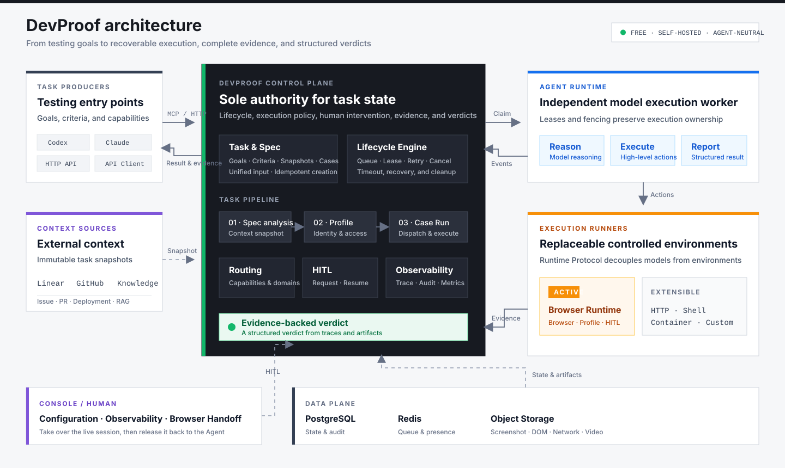

# DevProof

**English** | [简体中文](README.zh-CN.md)

DevProof is a free, self-hosted AI test execution and verification platform. It turns testing goals submitted by Codex, Claude, or any other agent into schedulable, recoverable, and auditable tasks, while managing test specifications, execution environments, human intervention, evidence, and final verdicts in one place.

DevProof itself is free. Model usage, compute, object storage, and third-party service costs are paid by the operator.

## What problem does DevProof solve?

AI agents can generate test steps and operate a browser, but reliable test execution involves much more than model reasoning: tasks must be queued and retried, execution environments must be selected, authenticated state must be isolated, interrupted work must recover safely, human help must be requested at the right time, and every conclusion must be backed by evidence.

When every agent implements these capabilities independently, the same problems tend to reappear:

- Test entry points and result formats differ, making execution difficult to reuse across agents.
- Long-running tasks lack leases, timeouts, cancellation, retries, and disconnection recovery.
- Login, CAPTCHA, and MFA flows cannot be handed to a human safely and then resumed.
- Screenshots, DOM snapshots, console logs, network traces, and video end up scattered across tools, making conclusions hard to audit or reproduce.
- Browser, HTTP, shell, and container environments become tightly coupled to individual agents and are difficult to scale or replace independently.
- Context from issues, pull requests, and knowledge bases has no stable snapshot, so the inputs may change between runs.

DevProof brings these concerns into a single control plane. Callers describe the goal, acceptance criteria, and required capabilities; DevProof turns them into a complete task lifecycle and returns a structured verdict with its supporting evidence.

## Architecture

The system is organized into four layers:

1. **Task Producer**: Codex, Claude, Playground, or another client creates tasks and reads results through MCP or HTTP without managing browser sessions or low-level execution lifecycles.
2. **Control Plane**: the DevProof API is the sole authority for task state. It owns specification analysis, Case/Run orchestration, leases, retries, cancellation, HITL, cleanup, and aggregate verdicts.
3. **Agent Runtime**: a lightweight, independently deployable worker claims Runs, invokes a model for reasoning, and sends high-level actions to an Execution Runner.
4. **Execution Runner**: a controlled environment in which actions actually run. Browser Runtime is the first Runner; the protocol boundary is designed to support HTTP, shell, and container Runners as well.

Screenshots, DOM snapshots, console logs, network traces, video, and structured events flow back into the control plane, creating an evidence chain from task input through execution trajectory to final verdict. The Console uses the same control plane for configuration, observability, and human handoff.

Browser Runtime is the first Execution Runner, not the platform boundary. The user-facing `TaskExecution` is the aggregate root. Issue tasks always contain three stages—Spec Analysis, Profile Resolution, and Spec Execution—while the original `ExecutionRun` remains the Case-level carrier for actual execution and evidence. Web Playground is only a task creation entry point; it no longer owns a separate model loop or task state.

## Technology baseline

- Web: Next.js 16, React 19, and Tailwind CSS 4
- API: NestJS 11 and Fastify
- Data: PostgreSQL 17 and Prisma 7
- Contracts: Zod 4
- UI: standalone `@devproof/ui`, with square corners, a 216 px Console sidebar, a 48 px top bar, and DevProof design tokens
- Runtime: an independent Node.js daemon registered with a one-time token; long-lived credentials remain on the runtime host

## Core roles

- **DevProof API**: the sole control plane for Tasks, Stages, Spec Snapshots, Cases, Runs, retries, cancellation, HITL, cleanup, and aggregate verdicts
- **Agent Runtime**: a stateless lease worker responsible for model reasoning and the high-level Browser Verification Executor
- **Task Producer**: Codex, Claude, Playground, or any other caller that creates tasks
- **Execution Runner**: a concrete controlled environment such as Browser, HTTP, shell, or container

## Current scope

- Feishu Web SSO
- `tenant_key` enforcement that limits an instance to one configured Feishu tenant
- A single Team scope in which team members share configuration and business data
- Team-level machine credentials scoped for reading, creating, and cancelling verification tasks
- Agent-neutral Run v2 with goals, acceptance criteria, agent provenance, capabilities, evidence, and HITL policies
- The `/v2/tasks` user task API, Case-level `/v2/runs` API, and high-level Task MCP tools
- Browser Runtime as an `ExecutionRunner` adapter, including capability discovery, automatic evidence association, and terminal cleanup
- Event-driven HITL coordination, timeout policies, and a durable Feishu notification outbox
- A unified Playground flow: Issue → Task → Spec Analysis → Profile Resolution → Spec Execution; direct tasks skip the first two stages
- Linear, GitHub, and Knowledge context resolution; immutable task-level Spec Snapshots; deterministic Cases; and dispatch retries
- Team-level Browser Runtime, Profile, and HITL settings
- Runtime routing policies based on exact domains or `*.` wildcard domains
- One-time Browser Runtime pairing, outbound WebSocket connections, protocol negotiation, online-state detection, and credential revocation
- Remote browser sessions, concurrency slots, leases, and fencing tokens
- Browser command responses, timeouts, cancellation, disconnection reconciliation, and restart recovery
- Per-step screenshots, automatically composed WebM video, DOM capture including open Shadow DOM, console and network artifacts in dedicated object storage; exact URL filtering, length limits, and redaction for JSON response bodies
- AI accessibility snapshots, strict browser commands, and direct MCP image/text artifact reads
- An outbound SSRF proxy for Browser Runtime, navigation-origin policy, and an exact private-network allowlist
- Structured criterion/evidence constraints in the Run v2 Browser Executor, business-source evidence, and deterministic network fault injection
- Durable Run v2 `HITL requested/resolved` outbox events and signed resume webhooks for external agents
- Persistent and ephemeral Profiles with human takeover
- User-level Browser Profiles with exact authorization, FIFO exclusivity across Tasks, Runtime affinity, and protocol v1.10 lifecycle cleanup after 30 days of inactivity
- Team configuration audit logs
- Test Projects, Environments, and fixed Case DSL v1
- Immutable Case Versions, replayable Run Snapshots, and idempotent creation
- Append-only Traces, object artifact references, and HITL Checkpoint foundations
- W3C Trace/Request correlation, MCP/HTTP tool invocation auditing, and agent model/tool trajectories
- Real readiness checks, Prometheus metrics, worker heartbeats, alert rules, and an observability Console
- Policy-driven event and artifact retention with object-storage cleanup
- A single Run v2 control plane and three state axes: `lifecycle`, `executionDisposition`, and `verdict`
- Agent Runtime claim, heartbeat, fencing, event, and idempotent outcome protocols
- API-hosted BrowserExecution, cancellation/timeout cleanup, and database-backed HITL resume

`/v2/tasks` is the current user-facing task entry point. `POST /v2/runs` remains compatible by creating a `DIRECT_RUN` Task and returning its child Run; the remaining `/v2/runs` endpoints provide access to concrete execution resources. Legacy `/v2/specifications` endpoints retain only list and detail reads, while writes return `410 Gone`, and the Console no longer exposes a standalone Spec panel. Legacy `/v1/verifications` exists only for stored-record compatibility and migration drain-down. DevProof API is the only component allowed to advance Task/Run state, schedule retries, or perform execution cleanup.

## Local development

Requirements: Node.js 24, pnpm 10, and Docker.

1. Copy `.env.example` to `.env`, then configure a Feishu application and the allowed `tenant_key`.
2. Generate a 32-byte encryption key:

       openssl rand -base64 32

3. Start PostgreSQL, Redis, and object storage:

       docker compose up -d

4. Install dependencies, deploy the database schema, and start the application:

       pnpm install
       pnpm prisma:deploy
       pnpm dev

5. In Console → Access, generate an Agent Token and an Agent Runtime Token with only the `runtime:lease` scope. Set `DEVPROOF_AGENT_RUNTIME_TOKEN` and `OPENAI_API_KEY` in `.env`; compatible gateways may also set `OPENAI_BASE_URL`. Restart `pnpm dev`. The command always starts Web and API, and starts the single Agent Runtime only when the required credentials are present.

6. Spec analysis for Issue Tasks prefers the official Linear GraphQL API through `LINEAR_API_TOKEN`, with `LINEAR_MCP_BEARER_TOKEN` as a fallback. For issue-owner Profile mapping, also configure `LINEAR_WORKSPACE_ID`; use the stable Linear user ID as the primary identity and a unique verified email only as a one-time backfill fallback. `GITHUB_TOKEN` enriches the snapshot with PRs, checks, files, and deployments. Knowledge MCP is optional; when using RAGFlow, set `KNOWLEDGE_MCP_TOOL` to a read-only retrieval tool.

Legacy Runtime Token, Worker ID, polling interval, and tool-limit environment variables remain accepted during migration. New configurations should use the `DEVPROOF_AGENT_*` names in `.env.example`.

Web listens on `http://localhost:3344` and API on `http://localhost:4433` by default. Docker maps PostgreSQL, Redis, and the MinIO API to host ports 55432, 56379, and 59000 to avoid conflicts with local services.

Production deployments can replace local object storage with Cloudflare R2 through its S3-compatible endpoint. Set `OBJECT_STORAGE_REGION=auto`, use a pre-created `OBJECT_STORAGE_BUCKET`, provide an R2 Access Key and Secret, and keep `OBJECT_STORAGE_FORCE_PATH_STYLE=true`. Step screenshots and final WebM videos use the same upload path.

The local `DATABASE_URL` should use port 55432 shown above. If you intentionally use an existing host PostgreSQL instance, do not also treat the Docker database as the active data source, and ensure the PostgreSQL session timezone is UTC. Use `pnpm prisma:migrate` only to create a new development migration; after pulling existing migrations, use `pnpm prisma:deploy`.

## Observability

The API exposes `/live`, `/ready`, and a Bearer-protected `/metrics` endpoint. Web readiness reflects the API's real dependencies. The Console observability page shows dependencies, workers, business backlogs, MCP/HTTP tool invocations, and control-plane audit events. Production requires `OBSERVABILITY_METRICS_TOKEN`.

Prometheus scraping, alerts, the Grafana dashboard, log fields, data retention, and alert runbooks are documented in [docs/observability.md](docs/observability.md).

## Feishu SSO configuration

Create a custom application in the Feishu developer console and add `FEISHU_REDIRECT_URI` to its redirect URL allowlist. The default local callback is:

    http://localhost:3344/auth/feishu/callback

Web proxies `/auth` requests to API on the same origin. The API exchanges the OAuth v2 code for a `user_access_token`, reads `tenant_key` from `user_info`, and creates a User, Team Membership, and Session only when it exactly matches `FEISHU_ALLOWED_TENANT_KEY`. Email domains are not used as a tenant identity boundary.

Official Feishu references:

- https://open.feishu.cn/document/common-capabilities/sso/api/obtain-oauth-code
- https://open.feishu.cn/document/authentication-management/access-token/get-user-access-token
- https://open.feishu.cn/document/server-docs/authentication-management/login-state-management/get

## Registering Browser Runtime

Browser Runtime is installed directly from checksummed GitHub Release assets; the
Runtime host does not need a DevProof repository checkout, Node.js, or pnpm.
Run this as the regular Linux user that will own the Runtime:

    curl -fsSL https://github.com/ethanyu-dev/devproof/releases/latest/download/install.sh | bash

The bootstrap downloads the latest Runtime package, package installer, and
`SHA256SUMS` from GitHub Releases, verifies both files, installs user-local
Node.js 24, Chromium, and a systemd user service, then leaves a new service
ready to pair. Initial Ubuntu/Debian installation requires passwordless sudo
for Chromium system dependencies and systemd linger.

After installation, open Console → Access → Execution Runtime, select Register,
and run the generated one-time pairing command on the same host. The command
pairs the device and starts its service. Generate the token only after the
initial installation because it expires after ten minutes.

By default, the daemon writes its long-lived credential to `.devproof-browser-runtime/runtime.json` under the user's home directory with mode `0600`. Set `DEVPROOF_RUNTIME_HOME` to change the location.

The daemon connects to Runtime Gateway over an outbound WebSocket and supports protocol negotiation, session leases, browser commands, HITL, reconnect reconciliation, and artifact uploads. It also owns on-disk cleanup for user Profiles: it scans at startup and hourly, atomically tombstones and deletes Profiles that have been unused for strictly more than 30 days and are not currently open, and leaves unmarked historical directories untouched.

### One-command Browser Runtime installation and upgrades

Upgrade each Runtime host with the same command used for installation:

    curl -fsSL https://github.com/ethanyu-dev/devproof/releases/latest/download/install.sh | bash

Existing hosts preserve `runtime.json`, Browser Profiles, and systemd
configuration. The installer downloads and warms the new package and browser
while the old service remains online, verifies that no Browser Session is
active before switching, upgrades in place, restarts the service, and confirms
that Runtime reconnects. Use `--version` to pin a release or `--force-active`
only when interruption risk is explicitly accepted:

    curl -fsSL https://github.com/ethanyu-dev/devproof/releases/latest/download/install.sh | \
      bash -s -- --version 0.2.12

A Runtime host must be able to use its systemd user manager and reach GitHub
Releases, the Node.js download source, npm registry, Playwright CDN, DevProof
API, and Runtime Gateway. An upgrade is rejected when active sessions are
detected unless `--force-active` is supplied.

Before pairing, configure `DEVPROOF_RUNTIME_NAME`, `DEVPROOF_MAX_CONCURRENCY`, and `DEVPROOF_HEADLESS` in `~/.config/devproof/browser-runtime.env`; restart the service after later changes. `DEVPROOF_MAX_CONCURRENCY` is used only as the host's initial capacity during first registration. Every successful installation records the package hash and timestamp in `~/.devproof-browser-runtime/install.json`. After the node is bound, use Console → Access → Runtime Access and Capacity to set the authoritative concurrency and allowed private-network hosts for each Runtime. The default block policy remains active when the allowlist is empty.

With multiple Runtimes registered, configure target domains under Console → Access → Execution Runtime → Domain Routing Policies. DevProof matches `execution.targetUrl`, with `inputs.targetUrl` retained for compatibility, against exact domains or `*.example.com` rules. Overlapping rules are ordered by priority, exactness, and match length. A matching rule restricts execution to its selected Runtimes and chooses whether to wait or fail immediately. Without a match, DevProof selects randomly from online, capability-compatible Runtimes.

## Agent integration

Generate a `dvp_sk_...` token under Console → Access → MCP Integration. HTTP requests use:

    Authorization: Bearer dvp_sk_...

The MCP endpoint is `http://localhost:4433/mcp` and uses the same Bearer token. Streamable HTTP MCP is recommended for Agent Runtime; HTTP API remains available as a compatibility entry point. Runtime stores credentials safely, invokes the model, resumes waiting states, and submits final results.

MCP exposes only the unified Task control plane: `get_integration_status`, `create_task`, `get_task`, `list_tasks`, `set_task_deployment_target`, `retry_task_stage`, and `cancel_task`. Use `get_run`, `resolve_run_intervention`, and `read_run_evidence` only when drilling down into Case-level Runtime details. Legacy Spec, Verification, browser command, Profile cleanup, and compatible `create_run` tools are no longer published. Callers do not receive Browser Sessions and do not call low-level `command`, `complete`, or `release` lifecycle tools. The read-only discovery resource is `devproof://task-tools`.

Console Playground is the end-to-end integration entry point. Issue mode creates a Task, then background workers resolve context into an immutable task-level Spec Snapshot, resolve the `EPHEMERAL`, `REQUESTER`, `ISSUE_ASSIGNEE`, or `EXPLICIT_PROFILE` strategy, and idempotently create a Run v2 for each Case. Direct mode creates a Task and skips analysis and Profile resolution. A user Profile may be used only for trigger sources and target domains authorized by its owner, and Tasks using the same Profile execute with FIFO exclusivity. Case dispatch uses database claims, stable idempotency keys, and background compensation; the Task Execution detail page presents stages, Cases, and recent errors together.

When an Agent requests HITL on a still-live Browser Session, the Task Execution detail page presents Browser Human Handoff. A human takes control of the Agent's original page to complete login, CAPTCHA, or MFA. Releasing control writes a structured response back to the same Runtime Task, which resumes under a new fencing lease. Live JPEG frames and mouse/keyboard input travel only over an ephemeral lease-protected channel and are not written to prompts, traces, the database, or object storage. The full browser data plane, SSRF protection, and fault injection require Browser Runtime protocol v1.2; physical control-plane cleanup requires v1.6; enhanced evidence capture requires v1.7; 30-day user Profile cleanup and lifecycle reporting require v1.8; and per-step screenshots and action video require v1.10. Rebuild and restart Runtime after upgrading the code.

## User-level Browser Profiles

When a Task requires authenticated user state but has no suitable Profile, the control plane creates a logical Profile from the target URL, environment, role, and trigger source. In Console → Browser Profiles, the user only completes remote login and confirms entry authorization; they do not enter domains, URL patterns, or selectors. Cookies, local storage, and browser directories remain only on the selected Browser Runtime. The control plane stores a random logical key, status, grants, and usage audit, and never returns the underlying key to Console, Feishu, or an Agent.

Issue Tasks support four strategies: `EPHEMERAL` by default; `REQUESTER` uses the Profile of the Console or Feishu requester; `ISSUE_ASSIGNEE` maps the owner through a Linear workspace and stable user ID; and `EXPLICIT_PROFILE` allows a signed-in user to select only their own Profile. When a Profile is unavailable, the Task may wait, fail, or explicitly fall back to an ephemeral session. The full model, state machine, cleanup, and rollout plan are documented in [docs/user-browser-profiles.md](docs/user-browser-profiles.md).

## Feishu group bot

After enabling `FEISHU_BOT_ENABLED`, configure the bot's stable `FEISHU_BOT_OPEN_ID`. In the Feishu developer console, set the encrypted event subscription callback to `/integrations/feishu/events`, subscribe to `im.message.receive_v1`, and grant the permissions required to read group messages, read user identity, and reply. The server validates the raw request signature, time window, verification token, app ID, tenant key, and mentioned bot `open_id`, stores the event idempotently by event ID, and creates the Task asynchronously. Use `@DevProof ENG-123 https://preview.example.com` in a group. The requester Profile is used by default; add `--owner` for the issue owner or `--ephemeral` for a temporary session. A user must sign in through Feishu SSO once to establish the stable identity mapping.

When a Task reaches a terminal state, the control plane replies to the original Feishu message through a durable outbox, or through a group bot webhook, and idempotently writes the same summary to the linked GitHub PR. Redelivery updates the existing marked task comment instead of creating duplicates. The notification links to the final result, including per-step screenshots and the action video stored in R2. `GITHUB_TOKEN` needs permission to write Issue/PR comments in the target repository.

Feishu HITL notifications use a custom group bot:

    FEISHU_NOTIFICATION_WEBHOOK_URL=https://open.feishu.cn/open-apis/bot/v2/hook/...
    FEISHU_NOTIFICATION_WEBHOOK_SECRET=...

## Railway deployment

The repository root provides Railway Config as Code files. Keep each service's Root Directory set to `/`, then configure these file paths in Railway Service Settings:

- API: `/railway.api.json`
- Web: `/railway.web.json`
- Agent Runtime: `/railway.agent-runtime.json`

API, Web, and Agent Runtime use their respective Dockerfiles. Before each API deployment starts, Railway runs `pnpm prisma:deploy`; a failed migration stops the release. Agent Runtime is deployed and scaled independently for the target execution environment and does not own a Playground-specific service.

The API Service requires at least PostgreSQL, Redis, object storage, Feishu, `CREDENTIAL_ENCRYPTION_KEY`, `API_PUBLIC_URL`, `WEB_ORIGIN`, and `RUNTIME_GATEWAY_WS_URL`. Configure Linear, GitHub, and Knowledge credentials only when their Issue-resolution features are needed. The Web Service needs `API_BASE_URL` at runtime, preferably the private HTTP address of the Railway API Service, and `NEXT_PUBLIC_RUNTIME_API_URL` at build time for external Runtimes. Public production URLs must use HTTPS and Runtime Gateway must use WSS.

Railway injects `PORT`. API and Web prefer their explicit service port variables and fall back to Railway's `PORT` when unset. Browser Runtime is not deployed to Railway; it remains a daemon on the target execution host and connects to API over outbound WSS.

## Engineering commands

    pnpm typecheck
    pnpm test
    pnpm build
    pnpm format:check

## Security constraints

- `CREDENTIAL_ENCRYPTION_KEY` must be a 32-byte base64 value; credentials use AES-256-GCM envelope encryption.
- OAuth state uses a ten-minute, HttpOnly, SameSite=Lax cookie.
- Session Tokens and Runtime Tokens are stored in the database only as SHA-256 hashes.
- Console mutation requests must originate from `WEB_ORIGIN`.
- MCP uses a Bearer machine identity and validates Host/Origin to prevent DNS rebinding.
- Verification input, external events, and HITL context/response reject credential-shaped fields.
- Pairing Tokens expire after ten minutes and may be consumed atomically only once.
- Production cookies are always Secure.

See the [documentation index](docs/README.md) for architecture, upgrades, operations, Browser Profiles, the Runtime protocol, and versioning. Existing installations should read the [upgrade guide](docs/upgrading.md) before deploying a new release. Contributions follow [CONTRIBUTING.md](CONTRIBUTING.md), and vulnerabilities should be reported privately according to [SECURITY.md](SECURITY.md).

## License

DevProof is available under the [Apache License 2.0](LICENSE).
