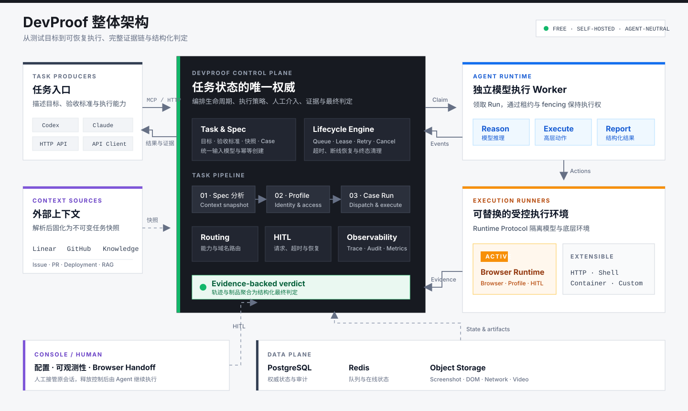

# DevProof

**简体中文** | [English](README.md)

DevProof 是一个免费的、自托管的 AI 测试执行与验证平台。它把 Codex、Claude 或其他 Agent 提出的测试目标，转换为可调度、可恢复、可审计的执行任务，并统一管理测试规格、运行环境、人工介入、证据和最终判定。

DevProof 本身免费；运行所需的模型、计算资源、对象存储及第三方服务费用由部署者自行承担。

## DevProof 解决什么问题

AI Agent 可以生成测试步骤或操作浏览器，但一次可靠的测试执行还涉及大量不属于模型推理的问题：任务如何排队和重试、使用哪个执行环境、登录态如何隔离、执行中断后如何恢复、何时请求人工处理，以及最终结论由哪些证据支撑。

如果每个 Agent 都分别实现这些能力，通常会出现以下问题：

- 测试入口和结果格式不一致，难以跨 Agent 复用。
- 长时间任务缺少租约、超时、取消、重试和断线恢复机制。
- 登录、验证码、MFA 等场景无法安全地交给人工接管后继续执行。
- 截图、DOM、Console、Network 和视频散落在不同工具中，结论难以审计和复现。
- 浏览器、HTTP、Shell 或容器等执行环境与 Agent 强耦合，难以独立扩容和替换。
- Issue、PR 和知识库中的上下文缺少稳定快照，任务重跑时输入可能已经变化。

DevProof 将这些问题收敛到一个统一控制面：调用方只需要描述目标、验收标准和执行能力，平台负责把它们组织成完整的任务生命周期，并返回结构化结论及证据。

## 整体框架



整体由四层组成：

1. **Task Producer**：Codex、Claude、Playground 或其他客户端通过 MCP/HTTP 创建任务并读取结果，不直接管理浏览器会话和底层执行生命周期。
2. **Control Plane**：DevProof API 是任务状态的唯一权威，负责 Spec 分析、Case/Run 编排、租约、重试、取消、HITL、清理和最终聚合判定。
3. **Agent Runtime**：独立部署的轻量 Worker，领取具体 Run，调用模型完成推理，并把高层动作发送给 Execution Runner。
4. **Execution Runner**：提供实际受控环境。Browser Runtime 是当前第一个 Runner；协议边界允许继续扩展 HTTP、Shell 和 Container Runner。

执行产生的 Screenshot、DOM、Console、Network、视频和结构化事件统一回传控制面，形成从任务输入、执行轨迹到最终结论的完整证据链。Console 在同一控制面上提供配置、可观测性和人工接管能力。

Browser Runtime 是第一个 Execution Runner，而不是平台边界。用户可见的 `TaskExecution` 是聚合根：Issue 任务固定包含“Spec 分析生成”“Profile 解析”和“Spec 执行”三个阶段；原 `ExecutionRun` 保留为 Case 级实际执行与证据载体。Web Playground 只是任务创建入口，不再拥有独立模型循环或任务状态。

## 技术基线

- Web：Next.js 16、React 19、Tailwind CSS 4
- API：NestJS 11、Fastify
- Data：PostgreSQL 17、Prisma 7
- Contracts：Zod 4
- UI：基于 Tailwind CSS 4 的本地 shadcn/ui 组件、按角色收敛的 Console 壳层与单一浅色视觉主题
- Runtime：独立 Node.js daemon，通过一次性 Token 注册，长期凭证只保存在运行机器

### 本地 Console 角色

Console 默认使用普通成员视图，只展示团队全部任务及任务需要的浏览器登录流程。开发或演示完整管理控制台时，在浏览器 Console 执行：

```js
localStorage.setItem("devproof.admin", "true");
location.reload();
```

恢复普通成员视图：

```js
localStorage.removeItem("devproof.admin");
location.reload();
```

该开关只控制当前浏览器中的前端展示，不是权限边界；生产环境的管理员授权仍需由后端实现。

## 核心角色

- DevProof API：唯一控制面，负责 Task、Stage、Spec Snapshot、Case、Run、重试、取消、HITL、清理与聚合判定
- Agent Runtime：无业务状态的租约 Worker，负责模型推理和高层 Browser Verification Executor
- Task Producer：Codex、Claude、Playground 或其他创建任务的调用方
- Execution Runner：Browser、HTTP、Shell、Container 等具体受控执行环境

## 当前范围

- 仅飞书 Web SSO
- 使用 tenant_key 将实例限定到指定飞书租户
- 所有业务数据以唯一 Team 为作用域，团队成员读写同一份配置
- 团队级机器凭证，按读取、创建和取消验证任务授权
- Agent-neutral Run v2：目标、验收标准、Agent 来源、执行能力、证据与 HITL 策略
- `/v2/tasks` 用户任务 API、Case 级 `/v2/runs` API 与高层 Task MCP 工具
- Browser Runtime 的 `ExecutionRunner` Adapter、能力发现、证据自动关联与终态清理
- 事件驱动 HITL Coordinator、超时策略和飞书通知 Outbox
- 统一执行 Playground：Issue → Task → Spec 分析生成 → Profile 解析 → Spec 执行；直接任务跳过前两个阶段
- Linear/GitHub/Knowledge 上下文解析、任务级不可变 Spec Snapshot、确定性 Case 与派发重试
- 团队级 Browser Runtime、Profile 与 HITL 设置
- 基于精确域名或 `*.` 通配域名的 Runtime 执行路由策略
- Browser Runtime 一次性配对、outbound WebSocket、协议协商、在线判定与凭证撤销
- 远程浏览器会话、并发槽位、租约与 fencing token
- 浏览器命令的响应、超时、取消、断线对账和重启恢复
- 每一步浏览器操作的 Screenshot、自动合成的 WebM 视频、DOM（含开放 Shadow DOM）、Console、Network 制品上传到独立对象存储；JSON 响应体按 URL 精确筛选、限长并脱敏
- AI accessibility snapshot、严格 Browser 命令、MCP image/text artifact 直读
- Browser 出站 SSRF proxy、导航 origin 策略和精确内网 allowlist
- Run v2 Browser Executor 的结构化 criterion/evidence 约束、业务来源证据与确定性网络故障注入
- Run v2 HITL requested/resolved durable outbox 与外部 Agent 恢复签名 webhook
- Persistent/Ephemeral Profile 与人工接管
- 用户级 Browser Profile、精确授权、跨 Task 独占队列、Runtime 亲和，以及 protocol v1.10 的 30 天不活跃生命周期清理
- 团队配置变更审计
- Test Project、Environment 和固定 Case DSL v1
- 不可变 Case Version、可重放 Run Snapshot 与幂等创建
- 追加式 Trace、对象制品引用和 HITL Checkpoint 数据底座
- W3C Trace/Request 关联、MCP/HTTP Tool 调用审计、Agent 模型与工具轨迹
- 真实 Readiness、Prometheus 指标、Worker 心跳、告警规则和可观测性 Console
- 按 Run 策略执行的事件/制品保留与对象存储清理
- Run v2 的单一控制面与 `lifecycle / executionDisposition / verdict` 三状态轴
- Agent Runtime 的 claim、heartbeat、fencing、事件与幂等 outcome 协议
- API 托管的 BrowserExecution、取消/超时清理和同库 HITL 恢复

`/v2/tasks` 是新的用户任务入口；`POST /v2/runs` 会兼容地创建 `DIRECT_RUN` Task 并返回其子 Run，其余 `/v2/runs` 接口用于下钻实际执行资源。旧 `/v2/specifications` 仅保留列表和详情读取，写接口返回 `410 Gone`，Console 不再提供独立 Spec 面板。旧 `/v1/verifications` 仅用于存量记录兼容和迁移期排空。DevProof API 是唯一能够推进 Task/Run 状态、安排重试和执行清理的组件。

## 本地启动

要求 Node.js 24、pnpm 10 和 Docker。

1. 复制 .env.example 为 .env，填写飞书应用和允许访问的 tenant_key。
2. 生成 32 字节密钥：

       openssl rand -base64 32

3. 启动独立 PostgreSQL、Redis 和对象存储：

       docker compose up -d

4. 安装依赖、创建数据库结构并启动：

       pnpm install
       pnpm prisma:deploy
       pnpm dev

5. 在 Console → 接入配置 → Agent 模型配置中维护团队级有序模型列表。每项只包含 Base URL、加密 API Key、Model ID 和 Display Name；列表顺序同时决定故障下沉与恢复优先级。Spec 分析与浏览器执行使用独立的 Agent Runtime 身份，分别执行 `pnpm --filter @devproof/api runtime:provision -- --team default --pool SPEC_ANALYSIS` 和 `pnpm --filter @devproof/api runtime:provision -- --team default --pool BROWSER_EXECUTION`。本地开发时，将仅显示一次的两个 Token 分别配置为 `DEVPROOF_SPEC_ANALYSIS_RUNTIME_TOKEN` 和 `DEVPROOF_BROWSER_EXECUTION_RUNTIME_TOKEN`，`pnpm dev` 会自动启动两个 Runtime 进程；独立部署的 Runtime 进程仍将对应 Token 配置为 `DEVPROOF_AGENT_RUNTIME_TOKEN`。如需访问私网或 HTTP 模型网关，由部署管理员通过 `DEVPROOF_AGENT_MODEL_HOST_ALLOWLIST` 配置精确主机名或 IP。

6. Issue Task 的 Spec 分析优先使用 `LINEAR_API_TOKEN` 调用官方 GraphQL，也可回退到 `LINEAR_MCP_BEARER_TOKEN`。Issue owner Profile 映射建议同时配置 `LINEAR_WORKSPACE_ID`，并以 Linear 稳定用户 ID 为主、唯一且已验证的邮箱为一次性回填兜底。在 Console 的“接入配置”中按组织或精确仓库保存多条团队加密 GitHub PAT，并设置优先级，用于补充 PR、Checks、Files 与 Deployment。Knowledge MCP 为可选增强；连接 RAGFlow 时将 `KNOWLEDGE_MCP_TOOL` 设置为只读检索工具。

安全迁移会撤销原先通过 Console 签发的 Runtime Token，需要使用上述运维命令重新签发。旧的 Runtime Token 环境变量名、Worker ID、轮询间隔和工具上限环境变量名在迁移期间仍可读取；模型 API Key 与 Base URL 只在 Console 管理，新的 Runtime 参数统一使用 `.env.example` 中的 `DEVPROOF_AGENT_*` 名称。

Web 默认监听 http://localhost:3344，API 默认监听 http://localhost:4433。
Docker 中的 PostgreSQL、Redis、MinIO API 分别映射到宿主机 55432、56379、59000 端口，避免与本机服务冲突。

生产环境可直接把对象存储切换到 Cloudflare R2：使用账户的 S3 API Endpoint，设置 `OBJECT_STORAGE_REGION=auto`、预先创建的 `OBJECT_STORAGE_BUCKET`、R2 Access Key/Secret，并保持 `OBJECT_STORAGE_FORCE_PATH_STYLE=true`。步骤截图和最终 WebM 视频会沿用同一上传链路。
本地 `.env` 的 `DATABASE_URL` 应与上述 55432 端口保持一致；如果明确使用宿主机已有的 PostgreSQL，请不要同时把 Docker 数据库当成当前数据源，并确保 PostgreSQL 会话时区为 UTC。`pnpm prisma:migrate` 仅用于创建新的开发迁移，拉取已有迁移后使用 `pnpm prisma:deploy`。

## 可观测性

API 提供 `/live`、`/ready` 和带 Bearer 保护的 `/metrics`；Web 使用 API 的真实依赖 Readiness。Console 的“系统监控”页面可查看依赖、Worker、业务积压、MCP/HTTP Tool 调用和控制面操作记录。生产环境必须配置 `OBSERVABILITY_METRICS_TOKEN`。

Prometheus 抓取、告警、Grafana Dashboard、日志字段、数据保留和逐项告警处置见 [docs/observability.md](docs/observability.md)。

## 飞书 SSO 配置

在飞书开发者后台创建自建应用，并把 FEISHU_REDIRECT_URI 加入安全设置中的重定向 URL。默认本地回调是：

    http://localhost:3344/auth/feishu/callback

Web 会把 /auth 请求同源代理到 API。API 使用 OAuth v2 换取 user_access_token，再读取 user_info 中的 tenant_key。只有它和 FEISHU_ALLOWED_TENANT_KEY 完全相等才会创建用户、Team Membership 与 Session。邮箱域名不参与租户身份判定。

飞书官方参考：

- https://open.feishu.cn/document/common-capabilities/sso/api/obtain-oauth-code
- https://open.feishu.cn/document/authentication-management/access-token/get-user-access-token
- https://open.feishu.cn/document/server-docs/authentication-management/login-state-management/get

## 注册 Browser Runtime

Browser Runtime 直接从 GitHub Release 安装，Runtime 主机无需 clone DevProof
仓库，也无需预装 Node.js 或 pnpm。请使用最终运行 Runtime 的普通 Linux 用户执行：

    curl -4 -fsSL https://github.com/ethanyu-dev/devproof/releases/latest/download/install.sh | bash

引导脚本从 GitHub Releases 下载最新 Runtime 包、本机安装器和
`SHA256SUMS`，校验两个文件后安装用户态 Node.js 24、Chromium 与 systemd
用户服务。全新 Ubuntu/Debian 主机首次安装 Chromium 系统依赖和启用
systemd linger 时需要免交互 sudo。

安装完成后，在 Console 的“接入配置 → 浏览器执行节点”点击“注册”，并在同一
主机执行生成的一次性配对命令；该命令会完成设备配对并启动服务。配对 Token
有效期为 10 分钟，因此应在初次安装完成后再生成。

daemon 默认把长期凭证以 0600 权限写入用户目录下的 .devproof-browser-runtime/runtime.json。可通过 DEVPROOF_RUNTIME_HOME 改变位置。

daemon 通过 outbound WebSocket 连接 Runtime Gateway，支持协议协商、会话租约、浏览器命令、HITL、重连对账与制品回传。用户级 Profile 的磁盘清理由 daemon 自身执行：启动时和每小时扫描一次，严格超过 30 天未使用且当前未打开的 Profile 会被原子 tombstone 后删除；历史未标记目录不会误删。

### Browser Runtime 一键安装与升级

以后在每台 Runtime 主机重复执行同一条安装命令即可升级：

    curl -4 -fsSL https://github.com/ethanyu-dev/devproof/releases/latest/download/install.sh | bash

已有设备会保留 `runtime.json`、Browser Profile 和 systemd 配置，在旧服务
在线期间下载并预热新包与浏览器，切换前确认没有活跃 Browser Session，随后
原地升级、重启并确认重新上线。可用 `--version` 固定版本；只有明确接受会话
中断风险时才使用 `--force-active`：

    curl -4 -fsSL https://github.com/ethanyu-dev/devproof/releases/latest/download/install.sh | \
      bash -s -- --version 0.2.14

Runtime 主机需要能够使用 systemd user manager，并访问 GitHub Releases、
Node.js 下载源、npm registry、Playwright CDN、DevProof API 与 Runtime
Gateway。已有设备检测到活跃会话时默认拒绝升级，除非显式传入
`--force-active`。

新设备应在配对前通过 `~/.config/devproof/browser-runtime.env` 配置 `DEVPROOF_RUNTIME_NAME`、`DEVPROOF_MAX_CONCURRENCY` 和 `DEVPROOF_HEADLESS`；后续修改后重启服务即可。其中 `DEVPROOF_MAX_CONCURRENCY` 只作为设备首次注册时的初始容量。每次成功安装的包哈希与时间记录在 `~/.devproof-browser-runtime/install.json`。节点绑定后，在“接入配置 → Runtime 访问与容量”为各 Runtime 设置控制台权威并发容量和允许访问的内网主机；未配置白名单时继续执行默认拦截。

多个 Runtime 注册后，可在“接入配置 → 浏览器执行节点 → 域名路由策略”配置目标域名。DevProof 使用 `execution.targetUrl`（兼容 `inputs.targetUrl`）匹配精确域名或 `*.example.com` 规则；重叠规则按优先级、精确程度和匹配长度决定。命中规则后只使用规则指定的 Runtime，并按规则选择等待或立即失败；未命中规则时，从在线且能力匹配的 Runtime 中随机分配。

## Agent 工具接入

在 Console 的“接入配置 → MCP 接入”生成 `dvp_sk_...` Token。HTTP 使用：

    Authorization: Bearer dvp_sk_...

MCP 地址为 `http://localhost:4433/mcp`，使用同一 Bearer Token。Agent Runtime 推荐使用 Streamable HTTP MCP；HTTP API 作为兼容入口。Runtime 负责安全保存凭证、调用模型、恢复等待状态和提交最终结果。

MCP 只提供统一 Task 控制面：`get_integration_status`、`create_task`、`get_task`、`list_tasks`、`set_task_deployment_target`、`retry_task_stage` 和 `cancel_task`。需要下钻 Case Runtime 时再使用 `get_run`、`resolve_run_intervention` 和 `read_run_evidence`。旧 Spec、Verification、Browser command、Profile 清理及 `create_run` 兼容工具均不再发布；调用方不获取 Browser Session，也不调用 command/complete/release 等低层生命周期工具。只读发现资源为 `devproof://task-tools`。

Console 的 Playground 是端到端集成入口。Issue 模式先创建 Task，后台 Worker 解析上下文并写入任务级不可变 Spec Snapshot，再解析 `EPHEMERAL`、`REQUESTER`、`ISSUE_ASSIGNEE` 或 `EXPLICIT_PROFILE` 策略，最后为每个 Case 幂等创建 Run v2；直接模式创建 Task 并跳过分析和 Profile 解析。用户 Profile 只能在所有者授权的触发来源与目标域名中使用，同一 Profile 的 Task 按 FIFO 独占执行。Case 派发使用数据库 claim、稳定幂等键与后台补偿，阶段、Case 和最近错误统一显示在“任务执行”详情中。

当 Agent 在仍然存活的 Browser Session 上请求 HITL 时，“任务执行”详情会显示 Browser Human Handoff：人工接管 Agent 的原页面完成登录、验证码或 MFA，释放控制后将结构化响应写回同一个 Runtime Task，再由新的 fencing lease 恢复执行。实时 JPEG 和鼠标/键盘输入只走受租约保护的瞬时通道，不写入 Prompt、Trace、数据库或对象存储。完整 Browser 数据面、SSRF 与故障注入能力要求 Browser Runtime protocol v1.2；控制面物理清理要求 v1.6；增强证据采集要求 v1.7；用户 Profile 30 天自动清理与生命周期回报要求 v1.8；逐步截图和操作视频要求 v1.10。升级代码后需重新构建并重启 Runtime。

## 用户级 Browser Profile

Task 需要用户登录态但没有可用 Profile 时，控制面会根据目标 URL、环境、角色和触发来源自动创建逻辑 Profile；用户在 Console 的“浏览器身份”中只负责完成远程登录并确认入口授权，不填写域名、URL pattern 或 selector。Cookie、localStorage 和浏览器目录只保存在指定 Browser Runtime；控制面只保存随机逻辑 key、状态、授权与使用审计，API 不向 Console、飞书或 Agent 返回底层 key。

Issue Task 可使用四种策略：默认 `EPHEMERAL`；`REQUESTER` 使用控制台或飞书发起人的 Profile；`ISSUE_ASSIGNEE` 通过 Linear workspace + stable user id 映射 owner；`EXPLICIT_PROFILE` 只允许已登录用户指定自己名下的 Profile。Profile 不可用时可等待、失败或显式降级为临时会话。完整模型、状态机、清理与上线方案见 [docs/user-browser-profiles.md](docs/user-browser-profiles.md)。

## 飞书群机器人

开启 `FEISHU_BOT_ENABLED` 后，配置机器人的稳定 `FEISHU_BOT_OPEN_ID`，并在飞书开发者后台把加密事件订阅回调配置为 `/integrations/feishu/events`，订阅 `im.message.receive_v1` 并授予读取群消息、读取用户身份和回复消息所需权限。服务端验证原始请求签名、时间窗、verification token、app id、tenant key 和被 @ 的 bot open_id，按 event id 幂等入库后异步创建 Task。群内使用 `@DevProof ENG-123 https://preview.example.com`；默认采用发起人 Profile，可加 `--owner` 使用 Issue owner，或 `--ephemeral` 强制临时会话。用户须先通过飞书 SSO 登录一次以建立稳定身份映射。

Task 进入终态后，控制面通过 durable outbox 回复原飞书消息（或群机器人 Webhook），并把同一份汇总结果幂等回写到关联的 GitHub PR；重复投递会更新带任务标记的原评论，不会刷出重复评论。通知链接打开最终结果，可查看逐步截图和 R2 中的操作视频。GitHub 回写要求路由命中的 Console PAT 对目标仓库具备 Issue/PR comment 写权限。

飞书 HITL 通知使用群自定义机器人：

    FEISHU_NOTIFICATION_WEBHOOK_URL=https://open.feishu.cn/open-apis/bot/v2/hook/...
    FEISHU_NOTIFICATION_WEBHOOK_SECRET=...

## Railway 部署

仓库根目录提供 Railway Config as Code 文件。各 Service 的 Root Directory 都保持 `/`，并在 Railway Service Settings 中分别设置以下 Config File 路径：

- API：`/railway.api.json`
- Web：`/railway.web.json`
- Agent Runtime：`/railway.agent-runtime.json`

API、Web 和 Agent Runtime 使用各自的 Dockerfile。API 每次部署都会在新版本启动前执行 `pnpm prisma:deploy`；迁移失败时 Railway 会终止本次部署。Agent Runtime 按目标执行环境独立部署和伸缩，不拥有 Playground 专用服务。

API Service 至少需要配置 PostgreSQL、Redis、对象存储、飞书、`CREDENTIAL_ENCRYPTION_KEY`、`API_PUBLIC_URL`、`WEB_ORIGIN` 和 `RUNTIME_GATEWAY_WS_URL`。Issue 解析按需配置 Linear、GitHub 与 Knowledge 凭据。Web Service 运行时需要配置 `API_BASE_URL`，推荐使用 Railway API Service 的私网 HTTP 地址；构建时需要配置供外部 Runtime 使用的 `NEXT_PUBLIC_RUNTIME_API_URL`。公网生产地址必须使用 HTTPS，Runtime Gateway 必须使用 WSS。

Railway 会注入 `PORT`；API 与 Web 会优先使用显式服务端口变量，并在未配置时回退到 Railway 的 `PORT`。Browser Runtime 不部署到 Railway，仍在目标执行机器上以 daemon 方式运行并通过 outbound WSS 接入 API。

## 工程命令

    pnpm typecheck
    pnpm test
    pnpm build
    pnpm format:check

## 安全约束

- CREDENTIAL_ENCRYPTION_KEY 必须是 32 字节 base64，密钥采用 AES-256-GCM 信封存储。
- OAuth state 使用 HttpOnly、SameSite=Lax、十分钟 Cookie。
- Session Token 与 Runtime Token 在数据库中只保存 SHA-256 hash。
- Console 修改请求必须来自 WEB_ORIGIN。
- MCP 使用 Bearer 机器身份，并校验 Host/Origin 以防 DNS rebinding。
- Verification 输入、外部事件与 HITL context/response 拒绝凭证形字段。
- 配对 Token 十分钟过期且只能原子消费一次。
- 生产环境 Cookie 强制 Secure。

架构、升级、运维、Browser Profile、Runtime 协议与版本策略见[文档索引](docs/README.md)。现有部署在发布新版本前应先阅读[升级指南](docs/upgrading.md)。参与贡献请遵循 [CONTRIBUTING.md](CONTRIBUTING.md)，安全问题请按 [SECURITY.md](SECURITY.md) 私下报告。

## 许可证

DevProof 使用 [Apache License 2.0](LICENSE)。
