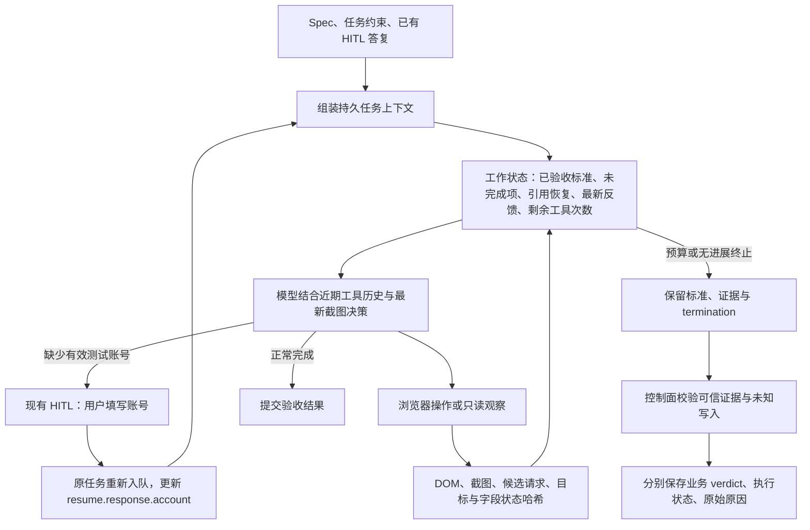

# Browser Runtime：账号 HITL 与操作反馈

日期：2026-09-09。状态：代码与回归测试已实现，尚未发布或在生产任务上验证。

根据任务 `e459d24a-9227-4906-843d-0fe1ef8a7fa2` 的调查，将优化拆成账号前置条件和浏览器执行反馈。账号方向按用户确认改为复用 HITL：用户提供测试账号，Agent 恢复原任务。首版不增加账号池、自动发现账号或测试数据分配服务。

## 问题依据

| Case | 观察事实                                                                   | 对应改动                                         |
| ---- | -------------------------------------------------------------------------- | ------------------------------------------------ |
| 1    | 两种新增类型可见，2/2 通过                                                 | 保留现有 DOM + 视觉验证                          |
| 2    | 将带时间戳的示例当成用户账号，反复保存，未读取网络诊断                     | 账号 HITL、自动请求反馈、重复操作识别            |
| 3    | 两次 `400 / USER_NOT_FOUND`，之后换 UUID；截图出现新记录，但完整验收未完成 | 不自行取其他用户账号；保留业务错误与已完成验收   |
| 4    | 下拉滚动及失效 frame 引用恢复消耗工具预算                                  | 沿用已有有限定位恢复，补充引用范围说明、预算收尾 |

Case 2 未读取响应，不能直接套用 Case 3 的错误原因。调查时 Browser Runtime 仍为 0.2.22，未包含 PR #55 的 DOM 采集修复；需要新版本、新 Attempt 验证整体效果。

## 一、复用 HITL 提供测试账号

1. Spec 区分已有业务账号与可生成的名称、备注；不把随机字符串或时间戳声称为真实账号。
2. 正向验证缺少账号，或观察到提供的账号不存在/不可用时，Agent 请求现有 `request_human_input`，`kind=TEST_ACCOUNT`，说明页面字段和实际错误。
3. 执行器生成固定的单字段答复结构：`response.account`。Console 显示“提供测试账号”，用户填入当前环境适用的手机号、UUID 等页面支持的值，点击“提交并继续执行”。无需获取浏览器人工控制权。
4. API 复用现有 resolve、到期校验、父任务状态校验、等待时间返还和同任务重新入队流程。服务端拒绝空账号及超过 200 字符的值，保存去除首尾空白后的账号。
5. 答复进入 `executionPolicy.resume.response.account`，通过原有任务上下文持续提供给 Agent。恢复时重新观察保留的页面，再填写账号并核对结果。旧 DOM 引用和坐标不能直接重用。

HITL 请求由 Agent 根据页面、错误及验收目标判断，不硬编码目标网站的错误格式。账号不是密码，不新增密码采集。账号仍需满足目标环境的存在性、权限及本次测试用途；用户提供后遇到新错误需继续按证据判断。

如果 Case 本身验证“无效账号应被拒绝”，应保留负向输入。HITL 禁用时，缺数据的标准应为 `INCONCLUSIVE`，不盲目试号。各 Case 沿用现有并发调度；本次答复仅恢复对应 Run，不跨 Case 自动分配可写记录。

## 二、浏览器操作反馈与收尾

### 自动请求反馈

Browser Runtime 声明 `action-feedback-v1`。导航、点击、Enter、填写、选择等关键操作建立 Session 内的请求窗口；命令结果附带 `result.actionFeedback`，后续只读观察可更新同一窗口中的迟到响应。

- 根据请求开始序号和页面 ID 排除操作前已发起的请求及其他页面请求。保留请求的 frame URL。
- 只列出当前页面 fetch/XHR 的候选请求，`association=temporal` 表示时间关联，不证明因果，覆盖范围不包含所有浏览器网络活动。
- `inputCompleted` 表示输入调用已完成，不等于业务提交成功。HTTP 200 也可能包含业务错误。
- 复用同源 JSON 正文采集、敏感字段脱敏及原有大小限制；额外限制最多 8 条候选请求，整个反馈 JSON 最多 12 KiB。截断、正文缺失和仍在等待均显式标记。
- 有请求时生成 NETWORK 证据；页面仍沿用 DOM、截图及原有只读工具观察。不额外等待整站 networkidle，也不增加跨 Session 锁。
- `browser_working_state.latestActionFeedback` 保存最新摘要，不因只保留四轮工具历史而丢失。它是历史反馈，不能替代新的页面观察。

自动摘要不足以解释响应时，Agent 可以继续使用 `page.network`、DOM 和截图核对。没看到请求、一个 400、弹窗关闭或页面加载动画，都不能单独证明目标业务写入成功或未发生。

### 重复操作与引用恢复

点击、frame 点击和 Enter 尝试采集实际 DOM 目标及邻近表单字段状态的哈希；视觉坐标点击通过命中 DOM 识别目标。同一按钮内坐标变化不会被当成新目标，字段值不会作为新的诊断字段输出。

重复计数使用目标和字段状态，过程截图的动画或光标变化不能单独重置这项计数。新的 DOM 观察或验收进展可以重置计数，不同字段值允许继续尝试。仍采用保守的 60 秒观察宽限和重复上限：同一操作无进展超过 8 次且已过宽限，或快速重复超过 24 次时收尾。无法取得 DOM 目标时，沿用原有参数与观察检测，并由总工具/时间预算兜底；没有声称仅靠截图就能可靠识别所有语义重复。

已有失效引用恢复继续限制重试次数。Prompt 明确 `fN` 是范围标签，不能单独作为 frame 元素 ref。下拉滚动、页面滚动和表格横向滚动仍按实际 DOM 与截图范围检查，不要求目标网站添加 ARIA、测试属性或使用特定组件库。

### 保留结果的统一收尾

工具耗尽、时间收尾窗口、重复无进展和纯文本空转统一进入 finalize：已记录标准和证据保留，未验证标准记为 `INCONCLUSIVE`，记录 `termination.reason`。

工作状态展示剩余工具次数；正常工具预算下最后两次调用仅允许只读浏览器观察、记录结果、HITL 和结束，执行器拒绝新交互。少于 3 次的诊断用预算不启用这项预留限制。完全未执行浏览器命令的终止仍为 `NOT_RUN`，不会声称已验证。

API 对带 `termination` 的完成结果也执行未知写入审查。若需要核对写入：执行状态保持 `BLOCKED / WRITE_OUTCOME_UNKNOWN`，保留现有资源保护；`error.details.originalError` 保存原始停止原因与诊断；已完成标准及证据通过原有可信证据校验后落库；业务 verdict 与执行阻塞状态分别保留。不把模型判断或某个 HTTP 响应当作自动解除资源隔离的依据。

## 验证与部署

回归覆盖：账号格式校验与原任务恢复；已有 HITL 行为；HTTP 400 及 HTTP 200 业务错误；旧请求迟到、跨页面排除、pending 更新、截断与脱敏；真实 Chromium 保存错误反馈和字段状态变化；坐标抖动/动画重复检测；正常业务进展；预算收尾、可信证据及未知写入保护。

Agent 协议升级为 v2.12，新增可选 `termination`。**先部署 API 和 Console，再部署新 Agent，最后发布并正常升级 Browser Runtime。** 不支持先把新 Agent 的预算完成结果发给会忽略 `termination` 的旧 API。Browser 反馈是增量能力，旧节点缺少该反馈时仍可使用已有显式观察工具。

无数据库迁移。当前改动没有发布 release、升级生产节点或重跑原任务。发布后需用新的 Attempt 检查真实 Runtime 版本、DOM 内容、账号 HITL 和具体验收结果，不能用单元测试替代生产效果结论。
