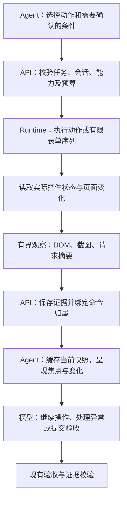

# Browser 验证交互改造方案

状态：方案草案，供实施和评审。日期：2026-09-15。

分析基线：`09c0159` 加当前工作区改动。工作区包含观察记忆、测试账号、会话恢复、控件点击等尚未提交的改动；实施时先固定这些改动的实际基线。本文提出的字段、模块和开关尚未实现。

## 1. 目标与总体决策

保留 Playwright、独立浏览器会话、API 调度和 Agent 验收架构，增强模型每一步获得的信息：当前页面是什么、动作实际产生了什么结果、接下来需要处理什么。

改造顺序：测量基线 → 动作结果反馈 → 动作与观察合并采集 → 聚焦与增量呈现 → 有界表单操作序列 → 对照验证及灰度。

目标：

- 减少填写后值不正确、重复保存、反复读取整页和无效定位。
- 减少 Runtime 往返、重复截图及模型输入中的无关内容。
- 保持验收标准、证据要求、任务截止时间和资源回收语义。
- 将页面失败、操作失败、观察不足分别表达，方便模型继续执行，也方便用户查看原因。

本轮范围是 Browser 验证交互。桌面 Computer Use 接入、模型更换、全局放宽超时及任意 JavaScript 执行接口不在首期交付中。

## 2. 当前基础与真实缺口

| 当前已有                                                                   | 本次补充                                          |
| -------------------------------------------------------------------------- | ------------------------------------------------- |
| DOM 标签、label、value、options、部分 ARIA 属性、Shadow DOM 和 iframe 观察 | 原生控件约束、焦点及区域关系、结构化节点输出      |
| 当前快照、分页、本地读取、引用有效性检查                                   | 聚焦摘要、具有明确基线的变化摘要                  |
| 动作后截图，BOUNDED 模式在页面变脏后自动 snapshot                          | 在一次 Runtime 命令内复用观察与图片，避免重复采集 |
| `action-feedback-v1` 的关联请求、响应摘要                                  | 实际控件状态、输入比较、明确的观察后置条件        |
| 同轮多个工具调用的执行循环                                                 | Runtime 内有界表单序列及每个子步骤的结果          |
| 两次定位恢复、进度检测、验收证据校验                                       | 对新结果、局部失败和新命令的完整接入              |
| 当前工作区中的历史观察记忆                                                 | 将新观察接入同一记忆和引用体系                    |
| 本地真实模型比较工具及五类 fixture                                         | 分阶段对照组、交互边界案例、分阶段计时            |

几个直接影响设计的代码事实：

1. `page.fill` 当前返回 `{ filled: true }`；`page.type` 返回 `{ typed: true }`。
2. 动作反馈目前以请求窗口为主，并明确关联是时间上的，不能自动视为因果关系。
3. 自动 snapshot 已在模型调用前完成；合并采集主要节省浏览器 RPC 和采集成本，模型轮数收益需要单独测量。
4. `captureStepArtifact` 当前通常先等待 100ms，再截图。下一次自动 snapshot 也会生成截图。
5. 每次新 snapshot 替换引用；当前完整快照指的是本次有界视口观察，不代表整个页面所有内容。
6. Browser 协议当前为 1.17，Agent 协议当前为 2.19；能力升级不能只修改 Runtime。
7. 部分文档还描述旧的上下文拼装方式，实施时应同步为当前 `ModelContext` 的操作摘要和固定当前页面机制。

## 3. 目标数据流



Runtime 负责读出确定的页面事实。Agent 负责将事实与 Spec 对照并作出验收判断。后置条件满足也必须经过现有验收提交路径。

## 4. 第一阶段：实际动作结果

### 4.1 返回格式

保留旧字段，在 `result` 中增加可选的 `actionOutcome`。以下为拟议结构示意：

```json
{
  "filled": true,
  "actionOutcome": {
    "version": 1,
    "execution": "COMPLETED",
    "targetState": {
      "value": "32",
      "focused": true,
      "constraints": { "min": "1", "max": "32", "required": false },
      "validity": { "valid": true, "rangeOverflow": false },
      "validationMessage": ""
    },
    "inputComparison": "MATCHED",
    "expectation": { "status": "NOT_REQUESTED" },
    "observedAt": "2026-09-15T04:00:00.000Z",
    "coverage": { "targetReadable": true, "truncated": false }
  }
}
```

三个状态分别建模：

| 维度         | 状态                                             | 含义                                         |
| ------------ | ------------------------------------------------ | -------------------------------------------- |
| 动作执行     | `COMPLETED / NOT_STARTED / UNKNOWN`              | 已完成动作、确认未启动、不能确认是否产生效果 |
| 输入比较     | `MATCHED / DIFFERENT / UNKNOWN / NOT_APPLICABLE` | 当前值与请求输入的比较；不是验收结论         |
| 显式后置条件 | `MET / NOT_MET / UNKNOWN / NOT_REQUESTED`        | 指定条件在观察范围和时间窗口内是否满足       |

保留命令原有成功/失败和错误字段。Playwright 调用返回后的值不一致放在 `inputComparison` 中；观察失败也不把已完成的动作改写成“未执行”。对输入超时、连接中断等不能排除副作用的情况使用 `UNKNOWN`。

### 4.2 读取字段

- input/textarea：当前值、类型、焦点、readonly、disabled、原生约束、有效性及校验提示。
- 原生 select：实际选中值和可见文本；checkbox/radio：实际 checked 状态。
- 自定义控件：已经观察到的文本和 ARIA 状态，并明确其来源；缺少原生约束时不补造 `valid: true`。
- 原生控件使用 `validity`、`validationMessage` 等只读属性；采集器不调用会触发校验事件或改变 UI 的方法。
- 目标节点被替换、iframe 卸载或类型无法读取时返回原因及 UNKNOWN，触发后续观察。
- value 比较默认精确；允许显式类型化的数值比较，但不自动抹掉用户输入中的格式差异。

对密码及现有敏感字段规则继续脱敏；可以在 Runtime 内比较输入是否一致，返回比较结果。普通执行遥测只保存比较状态、长度及耗时，不新增原始值。模型可见观察和持久证据走各自已有的脱敏、权限及保留策略。

值比较在截断前完成。建议模型摘要中的单个值及校验提示分别限制为 512 个字符，并携带截断标记；完整观察按已有制品及内容预算处理。整个反馈还需按序列化后的 UTF-8 字节数限长，不能用摘要的相等或缺失推断完整内容相等或不存在。

### 4.3 第一阶段交付边界

先覆盖 fill、type、select、check、uncheck 和 frame.fill。click/press 返回可读的动作后目标状态和现有请求反馈，不默认推断保存成功。不隐式追加 blur、Enter、点击或重试；这些行为可能提交表单。

## 5. 第二阶段：动作与观察合并

### 5.1 输入协议

在明确支持的现有动作 payload 中添加可选 `after` 字段，复用现有命令通路。不要添加到开放的任意字典中绕过校验。

```json
{
  "commandType": "page.fill",
  "payload": {
    "target": { "ref": "f1e23" },
    "text": "32",
    "after": {
      "observe": "TARGET_REGION",
      "expect": [{ "kind": "TARGET_VALUE_EQUALS", "value": "32" }],
      "timeoutMs": 1500
    }
  }
}
```

拟议允许列表：目标值、checked、原生 validity、指定范围内可见文本、URL 精确值或前缀。每次至多 4 个条件，首期按全部满足处理。条件内容作为数据解析，不接受脚本、任意函数或未经约束的表达式。

文本或 URL 条件区分“当前满足”和“本次从不满足变为满足”。保存成功提示应优先要求本次变化，避免旧 toast 造成误判。预期文本来自 Spec 或模型明确提出的验证条件；用户页面提供的内容按观察数据处理。

`after` 仅在运行节点支持对应能力时发送。旧节点继续使用动作 + 原有 snapshot 流程；旧节点不支持的后置条件不静默丢弃，也不在动作发送后因降级而重放动作。

### 5.2 Runtime 执行顺序

1. 检查会话、permit、控制代次、命令预算和目标引用；需要检测状态变化时记录条件的前态。
2. 执行原有 Playwright 动作。
3. 读取目标实际状态；如显式要求，执行只读的条件轮询。
4. 捕获一次规范化 DOM 观察与所需截图，附上采集起止时间、覆盖范围、截断状态和制品标识。
5. 读取动作对应的请求摘要，输出统一结果。

动作、条件轮询、DOM、截图均消耗同一命令预算，并受任务收尾预算约束。建议初始默认后置观察上限 1.5 秒，可显式配置到 5 秒，最终取剩余预算的较小值。这些是待测参数。

等待围绕具体条件，满足即返回；不强制等待所有网络请求结束。事件可能持续到来，读到的状态也不保证一直保持不变。观察注明时间范围，后续动作继续校验引用和图片有效性。

Playwright 已提供动作前的可操作性检查，断言机制也采用有界重试；本方案复用这一原则，在 Runtime 内实现可取消的只读观察，不要求引入整个测试运行器。[Playwright 动作等待](https://playwright.dev/docs/actionability)、[断言](https://playwright.dev/docs/test-assertions)。

### 5.3 采集复用

- 动作附带的规范化 snapshot 交给 `BrowserObservations` 作为当前观察；覆盖满足下一轮需要时跳过重复自动 snapshot。
- 如果只有目标局部信息，其他区域标记为未知或旧信息，不能当作全页已刷新。模型需要其他区域时继续刷新或扩展观察。
- 同一命令内的一张截图复用为步骤证据、视频帧和当前视觉输入，保留各自元数据和用途。
- 如果截图失败，保留动作结果和 DOM 观察；清空已过期图片，并要求视觉操作前重新截图。
- 首期保留现有证据采集要求。跳过无变化截图、减少中间视频帧等额外优化在实验单独验证后启用。
- 将固定的 100ms 等待逐步纳入有界观察策略；先测量，再对具备新能力的路径替换，避免静态删掉等待造成证据过早。

## 6. 第三阶段：聚焦和增量呈现

### 6.1 先建立结构化快照

在现有 DOM 文本输出旁增加可选结构化节点数据，并从同一份采集结果生成文本，避免两套采集逻辑对页面状态产生不同描述。

每个节点包含：内部节点键、当前 ref、frame/文档标识、标签、可观察名称及来源、值与约束、状态、包围框、父区域。ARIA 可作为补充；无 ARIA 的页面继续用原生标签、关联 label、可见文本及视觉观察。

明确区分：

- `nodeKey`：Runtime 内比较前后同一 DOM 节点的身份，只用于变化匹配，不能被工具当作操作定位符。
- `ref`：当前 snapshot 的操作引用；沿用新快照替换引用、节点脱离即失效的规则。
- `observationId`：本次观察及证据身份；模型引用和持久记录使用它关联事实。

节点键建议通过各真实 frame realm 内的 WeakMap 分配，并绑定文档生命周期。替换节点、导航、iframe 重建产生新身份。继承当前微前端兼容逻辑，避免依赖被站点覆盖的 ownerDocument/getRootNode 定位节点。不能用文本相同推断节点相同。

### 6.2 模型视图

建议每轮按以下顺序呈现：

1. 当前 URL、frame、对话框、焦点、覆盖范围。
2. 最新动作及实际结果。
3. 本次变化：新增提示、值变化、按钮启用/禁用、选项展开等。
4. 当前任务相关区域，以及下一步可能使用的控件及其当前 ref。
5. 完整有界快照的本地读取入口、未呈现内容数量及截图状态。

基础采集独立于验收目标；聚焦只影响模型视图。全局可见的错误、弹窗及页面切换优先呈现，避免只看目标区域漏掉阻断信息。普通 div 文本变化也保留，不能只识别 role=alert 的提示。

完整有界快照仍按现有上限缓存和保存。第一步先做确定性的区域摘要，再上线真正的 delta；记录两者分别节省多少字节。

### 6.3 增量正确性

- delta 必须携带 `baseObservationId`、当前 `observationId`、相同观察范围及完整性标记。
- Agent 持有匹配且完整的基线时才应用；基线缺失、范围改变、导航、HITL 恢复、节点上限或采集失败时回退当前快照。
- 不向模型只发送无法独立理解的差分：每轮仍包含当前可操作区域和最新 ref。
- 未变化但可操作的节点也需要呈现当前 ref；未交付的 ref 仍只能通过本地读取后使用。
- 旧值用于说明变化，旧 ref 不转成新 ref 的别名。增量缓存不能延长任何引用的有效期。
- 视口外内容、滚动容器内未看到的选项和 DOM 不可访问区域明确为未观察，不能从“没有变化”推导“不存在”。

96 KiB 文本预算、图片预算、UTF-8/JSON 转义长度及分页规则沿用当前实现。新增字段包含在真实序列化预算内；必要时依次缩减历史变化和次要区域，保持当前关键事实和截断提示。

## 7. 第四阶段：有界表单操作序列

### 7.1 新命令

建议新增能力 `form-sequence-v1` 和命令 `page.fill_fields`，作为 GROUPED 工具中的可选组。首期只支持同一页面、同一 frame、同一已观察表单区域内 1–6 个目标的 fill、check、uncheck、原生 select。自定义下拉展开、任意 click、Enter、导航及嵌套序列继续通过普通动作处理。

每个目标都必须来自当前已交付的观察。结构上相邻的字段不一定业务独立；Spec 或当前观察表明存在联动的字段应拆开执行。

序列是顺序执行，允许部分完成，不提供事务回滚承诺。即使只填写字段也可能触发自动保存，沿用潜在业务写入的审计规则。

### 7.2 执行规则

- 开始前校验输入数量、总长度、所有 ref 的观察归属和完整预算。
- 每个子步骤执行前后检查取消、permit、控制代次、页面/frame 和目标仍有效。
- 每步读取实际值并记录结果；观察到值不一致、目标替换、导航、意外弹窗、联动前提改变时停止。
- 不在中途生成会替换后续 refs 的完整 snapshot；逐步状态检查使用已验证目标的实时读取，结束或中断时统一创建新快照。
- 不自动追加失焦提交，也不自动重放已经开始的子步骤。
- 返回 `completedSteps`、`stoppedAt`、`stopReason`、每步状态、最终观察及证据。剩余步骤标记未执行。
- 终态证据证明最终状态；中间步骤只有采集并保存了对应观察才能独立用于该时点的验收。

### 7.3 中断与幂等

当前 Runtime 的外层 `Promise.race` 可以结束等待。新增循环必须把 AbortSignal 传入实际执行逻辑并在每一步检查，确保外层取消后不会继续启动下一个动作。正在进行的动作是否已经生效仍需观察确认。

复用命令 ID 去重及会话 fencing，并验证重复投递不会重新执行序列。若现有去重链路不足，补充有界的命令/子步骤记录后再启用序列。断线或进程退出后的未知部分进入既有不确定写入与恢复流程，不通过新 commandId 重放整批。

命令失败路径也要保存已获得的部分结果与制品。需要调整当前 Runtime 异常分支的空 artifacts 返回，以及 API 仅为成功命令加载视觉输入的条件；仍只接纳当前任务自身命令中已校验的制品。

### 7.4 预算与审计

模型工具调用计一次，底层每个子动作分别计入执行动作预算与审计；统一预算不能因为合并而绕过原有工具限制。单独记录自动观察、条件轮询和截图次数，比较时不把它们当成免费工作。

序列命令默认属于潜在写操作。当前审计使用安全观察命令白名单，新命令应保持在该白名单之外，并补回归测试。

## 8. Agent、证据及故障处理

### 8.1 Agent 接入

- `BrowserObservations` 统一接收普通 snapshot、动作附带 snapshot 和序列终态 snapshot。
- `ModelContext` 固定呈现动作结果和当前聚焦区域；差分历史服从预算。
- `BrowserToolCatalog` 根据节点实际协商能力展示字段和工具，工具定义在一次模型响应及其 fallback 期间保持固定。
- `VerificationProgress` 识别实际值变化、获得新观察和条件确认；重复“输入成功”不自动视为业务进展。
- 新观察进入当前 `rememberCriterionFacts` 和 `savedObservationIds` 路径，不再建立第二套长期记忆。
- 保留当前两次定位恢复上限及收尾路径；不能通过更换动作包装器或序列命令绕过限制。

### 8.2 证据规则

1. `inputComparison=MATCHED`、原生有效性通过、HTTP 200 均不自动成为 criterion PASSED。
2. Runtime 的真实后置观察必须有明确采集步骤、观察 ID、覆盖范围和持久制品。原有普通动作截图保持 `AFTER_ACTION` 含义。
3. 新的动作附带 snapshot 可作为 `OBSERVATION`，前提是走过真实快照采集、API 校验及制品归属绑定。不能仅根据结果中的布尔值或模型自报字段改标签。
4. delta 是模型视图；验收引用解析到保存的规范化快照原文或结构化事实，再走现有 criterion 校验。
5. 对网络请求继续保留 `association=temporal` 和覆盖不足标记；旁路数据库排查不替代被测页面的 UI 证据。
6. 观察因截断、节点失效或预算不足未完成时保留 UNKNOWN；最终根据 Spec 和证据决定 FAILED 或 INCONCLUSIVE。

### 8.3 故障决策表

| 观察到的情况                                | 处理                                               |
| ------------------------------------------- | -------------------------------------------------- |
| 请求填 32，实际值为 0                       | 记录 DIFFERENT，查看控件约束和事件行为；不自动再填 |
| 实际值为 32，但 max=4 且 rangeOverflow=true | 返回原生校验事实；由 Spec 判断这是预期拦截还是缺陷 |
| 保存后出现权限错误                          | 返回新错误文本和观察证据，停止重复保存             |
| 保存动作超时，页面已显示成功                | 先核实结果，避免重复写入                           |
| 实际动作完成但截图失败                      | 保留动作结果，视觉状态置为不可用                   |
| ref 过期/目标被替换                         | 刷新当前观察，进入既有有限定位恢复                 |
| 页面持续有轮询请求                          | 按具体可观察条件结束等待                           |
| 序列前三步完成，第四步失效                  | 保存前三步结果，停止后续，返回部分完成             |
| 用户接管或 permit 过期                      | 不再启动动作，保留已有证据，进入现有暂停/释放流程  |

## 9. API、协议与发布兼容

### 9.1 能力协商

按阶段新增拟议能力：`action-outcome-v1`、`action-observation-v1`、`structured-observation-v1`、`form-sequence-v1`。具体命名和 minor 在实施 PR 中统一登记。

- Browser 协议按现有规则递增 minor，旧字段语义保持不变。
- Agent 协议同步增加 acquire 返回的会话实际协议及协商能力信息；目前 acquire 返回中没有这些能力。
- 新能力需由 Runtime、网关、当前会话、Agent 共同确认，不能只检查 Runtime 包版本或数据库中的历史能力数组。
- `runtimeCommandMinimumMinor` 当前主要按命令名判断，须补充对 `after` 等新 payload 字段的能力检查；旧 page.fill 的最低版本不能因为新增字段而整体抬高。
- 新命令和字段都要通过 canonical Zod schema、Agent 工具 schema、API 入参、wire 消息及 Runtime 校验。
- 重连能力变化时重新校验；HITL 恢复及新 segment 重新获取当前状态，不恢复旧 ref 或 delta 基线。

### 9.2 配置与灰度

建议使用可分别控制的服务端执行策略项：动作结果消费、合并观察、聚焦视图、delta、表单序列。配置写入本次执行快照和实验 manifest；最终可用能力是策略允许与实际协商能力的交集。

上线顺序：

1. API/共享协议支持新字段、制品和能力；功能默认关闭。
2. 升级测试节点 Runtime，再升级 Agent 消费逻辑。
3. 在专用 fixture 环境分别启用各阶段，验证混合版本与回退。
4. 在允许灰度的团队和节点上启用单步反馈，再启用观察合并和聚焦。
5. delta 和表单序列分别通过对照后启用。

关闭开关影响下一次决策或新 segment；已经开始的命令按自身协议完成或被正式取消。回退不重发动作、不清除已保存证据。保留协议解析能力直到在途新格式命令结束。

首期优先复用结果 JSON、事件、执行快照和现有制品存储。若执行策略持久化需要扩展严格 schema，随协议变更一起完成；专用指标表仅在查询量证明确有必要后增加。

## 10. 控制台呈现

在现有执行轨迹中显示简明的实际结果：

```text
填写并发上限
实际值：32
输入校验：通过

保存设置
页面返回：当前身份没有执行恢复操作的权限
```

用户默认看到动作、实际状态、错误和下一步阻碍。工程细节如 ref、采集代次和 delta 基线放到诊断展开区。部分序列显示“已完成 3/5 项”，逐步展开查看，不显示整体成功。

## 11. 测量和验收

### 11.1 补齐指标

| 类别   | 指标                                                                             |
| ------ | -------------------------------------------------------------------------------- |
| 正确性 | criterion 正确率、错误通过数、错误失败数、INCONCLUSIVE、重复业务写入、证据完整性 |
| 模型   | 调用次数、输入/输出/cached tokens、模型与 HTTP 尝试耗时                          |
| 浏览器 | 命令数、底层动作数、自动观察数、条件读取数、定位恢复数、序列停止位置             |
| 采集   | DOM 字节数、模型实际呈现字节数、截图次数/字节数、证据上传及图像加载耗时          |
| 延迟   | 调度等待、命令往返、动作执行、条件等待、DOM、截图、持久化、总耗时的 p50/p95      |
| 状态   | 值不一致、UNKNOWN、无页面变化动作、delta 回退率、缺少所需内容后的补读次数        |

各阶段使用同一 commandId/stepId 关联；明确父子计时，避免将含等待的 RPC 总时间与内部截图时间重复相加。缺失数据记为 null，不能记为零。

### 11.2 对照设计

复用现有比较脚本，保留 A/B/C 的原含义。将当前 `BOUNDED + GROUPED` 的 C 作为此次基线，增加独立的 feature 配置：

| 新对照配置 | 开启内容                           |
| ---------- | ---------------------------------- |
| F0         | 固定当前基线                       |
| F1         | F0 + 实际动作结果                  |
| F2         | F1 + 合并观察                      |
| F3         | F2 + 聚焦/增量呈现（分别记录开关） |
| F4         | F3 + 表单序列                      |

同模型、同版本/配置、同 deadline、同动作预算、独立测试数据及会话，轮换组别顺序。先使用少量代表用例做 3 次烟测，再对完整案例每组重复 5 次；方差较大时扩展到现有脚本支持的 10 次，并说明统计不确定性。

保留失败、超时、清理失败和模型服务失败记录。成功样本延迟与全部样本的超时率同时报告；延长 deadline 的资格测试单列。fixture 服务端记录实际请求和最终数据，用于判断页面是否真的被操作正确。

### 11.3 必测案例

沿用现有表单、错误总价、popup+iframe、长流程、网络证据五类，再补：

1. number 输入 max=4 和 max=32；输入被前端重写为 0；无效值应被拦截的负向用例。
2. React 受控输入、失焦才校验、延迟自动保存、输入法/Unicode；确认观察不额外触发提交。
3. 同文案重复控件、节点被替换、Shadow DOM/iframe/微前端真实 realm、缺少 ARIA 的控件。
4. 旧成功 toast、迟到成功、新权限错误、HTTP 200 携带业务失败、持续网络轮询。
5. 观察截断、视口外目标、嵌套滚动、delta 基线丢失、刷新及同名新节点。
6. 截图/制品上传失败，保留动作事实；旧图片不能继续点击。
7. 序列中途失效、自动保存、超时/断线/取消/接管/permit 过期，验证后续动作未启动且不重复写入。
8. 敏感输入脱敏、伪造外部制品 ID、旧/未读 ref、after-action 图片冒充验收观察的拒绝路径。
9. 新旧 API、Agent、Runtime 的能力组合，以及运行中关闭开关。

Runtime 用真实 Chromium 测 DOM、输入和事件；Agent 测结果消费、预算、引用和验收；API 测协议、制品归属、部分结果、取消和审计；模型实验验证端到端效果。Mock 模型测试不能代替实际模型效果验证。

### 11.4 发布门槛

硬门槛：回归案例中不出现新增错误通过、重复写入、取消后继续启动子动作、引用越界或证据归属错误；必测 fixture 的可观察行为和最终判定正确。模型对照若出现任何新增错误通过，需要定位和修复后重新比较。

建议收益目标（验收方向，不是已有测量结果）：表单类模型调用中位数降低 20%；代表场景的模型页面文本字节数降低 30%；端到端耗时中位数降低 15%。同时检查 p95、超时率、补读率及成功率，避免用压缩内容换取错误。对每项特性分别决定是否默认开启，没有收益的特性继续关闭。

## 12. 实施拆分

| PR  | 交付                                                  | 依赖                         | 完成标准                                   |
| --- | ----------------------------------------------------- | ---------------------------- | ------------------------------------------ |
| 0   | 固定基线、分阶段计时、补输入边界和重复保存 fixture    | 当前并行改动基线确定         | 现状可复现，可比较                         |
| 1   | `actionOutcome`、控件约束、Agent 消费、控制台结果     | PR 0                         | 正确返回实际值、UNKNOWN 和负向校验事实     |
| 2   | `after`、有界条件观察、同命令采集复用、证据及能力协商 | PR 1                         | 少一次重复采集，完整证据，旧节点可用       |
| 3a  | 结构化快照、聚焦视图、覆盖和分页                      | PR 2                         | 模型看到当前关键区域，仍可读取省略内容     |
| 3b  | 节点身份、delta 基线及回退                            | PR 3a                        | 新引用正确，节点替换/导航/截断均有正确回退 |
| 4   | `page.fill_fields`、逐步结果、取消及潜在写审计        | PR 2；默认启用依赖 PR 3 验证 | 中断不继续、不重放，预算按底层动作计       |
| 5   | 真实模型对照、混合版本测试、灰度和运维说明            | 对应特性完成                 | 正确性门槛通过，逐项收益可解释             |

建议首批交付 PR 0–2，得到可用的“动作 + 实际结果 + 当前观察”闭环；随后根据实测决定聚焦、delta 和序列的开启节奏。所有阶段可以分别交付和回退。

## 13. 代码落点

仓库根目录：`/Users/mac/Desktop/ethankit-workspace/devProof`。以下是已核对的现有文件；新增模块名称为建议。

| 现有位置                                                                                                                         | 改造职责                                                                                               |
| -------------------------------------------------------------------------------------------------------------------------------- | ------------------------------------------------------------------------------------------------------ |
| [Runtime 协议](/Users/mac/Desktop/ethankit-workspace/devProof/packages/runtime-protocol/src/index.ts)                            | 新结果 schema、after、序列、能力及版本检查                                                             |
| [Agent 协议](/Users/mac/Desktop/ethankit-workspace/devProof/packages/agent-runtime-protocol/src/index.ts)                        | acquire 实际能力、执行配置和必要的观察协议                                                             |
| [DOM 观察](/Users/mac/Desktop/ethankit-workspace/devProof/apps/browser-runtime/src/dom-observation.ts)                           | 控件约束、结构化节点、身份与覆盖                                                                       |
| [动作反馈](/Users/mac/Desktop/ethankit-workspace/devProof/apps/browser-runtime/src/action-feedback.ts)                           | 保留网络关联语义，关联逐步请求窗口                                                                     |
| [Runtime 执行](/Users/mac/Desktop/ethankit-workspace/devProof/apps/browser-runtime/src/index.ts)                                 | 合并采集、取消传递、错误部分结果；建议拆出 action-outcome、post-action-observation、form-sequence 模块 |
| [API 命令分发](/Users/mac/Desktop/ethankit-workspace/devProof/apps/api/src/runtime/runtime-command-dispatcher.service.ts)        | 能力准入、部分结果及制品持久化、计时                                                                   |
| [Runtime 网关](/Users/mac/Desktop/ethankit-workspace/devProof/apps/api/src/runtime/runtime-gateway.service.ts)                   | 新能力协商、重连清理过时能力、结果及事件接入                                                           |
| [Browser 执行调度](/Users/mac/Desktop/ethankit-workspace/devProof/apps/api/src/verification/browser-execution-runner.service.ts) | 执行命令的 payload 能力校验、实际会话能力返回                                                          |
| [API 执行适配](/Users/mac/Desktop/ethankit-workspace/devProof/apps/api/src/agent-runtime/unified-browser-execution.service.ts)   | acquire 能力返回、动作后观察和图片归属校验                                                             |
| [API 写入审计](/Users/mac/Desktop/ethankit-workspace/devProof/apps/api/src/runtime/session-write-audit.ts)                       | 序列及未知子步骤的潜在写入回归                                                                         |
| [Agent 观察](/Users/mac/Desktop/ethankit-workspace/devProof/apps/agent-runtime/src/browser-observation.ts)                       | 新观察入库、有效引用、聚焦和 delta、历史事实                                                           |
| [Agent 执行器](/Users/mac/Desktop/ethankit-workspace/devProof/apps/agent-runtime/src/browser-verification.executor.ts)           | 自动观察去重、能力选择、序列预算及恢复                                                                 |
| [模型上下文](/Users/mac/Desktop/ethankit-workspace/devProof/apps/agent-runtime/src/model-context.ts)                             | 当前事实、视图优先级及序列化预算                                                                       |
| [工具目录](/Users/mac/Desktop/ethankit-workspace/devProof/apps/agent-runtime/src/browser-tool-catalog.ts)                        | 新字段和按能力显示的工具组                                                                             |
| [验收证据](/Users/mac/Desktop/ethankit-workspace/devProof/apps/agent-runtime/src/criterion-evidence.ts)                          | 新观察引用仍走统一校验                                                                                 |
| [比较脚本](/Users/mac/Desktop/ethankit-workspace/devProof/scripts/browser-comparison.mjs)                                        | 特性对照、版本/工作区指纹、重复与失败保留                                                              |
| [比较指标](/Users/mac/Desktop/ethankit-workspace/devProof/scripts/local-browser/metrics.mjs)                                     | 分阶段统计、动作预算及正确性结果                                                                       |
| [执行详情](/Users/mac/Desktop/ethankit-workspace/devProof/apps/web/app/console/runs/task-detail-content.tsx)                     | 实际结果和序列部分完成展示                                                                             |

每个实施 PR 同步更新相关协议文档、DOM/视觉文档、比较说明及版本兼容测试。本文保持为总体方案，实际字段与阶段进度在实现后回填。
