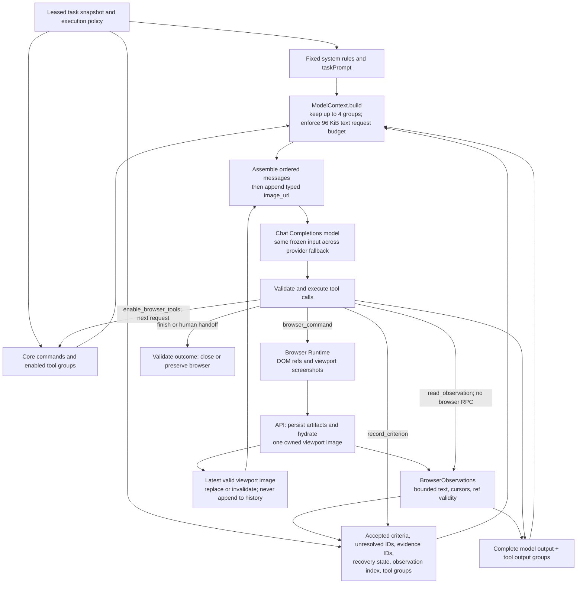

# DOM + visual browser observations

The verification Agent must work with sites it does not control. It observes
native DOM nodes and viewport pixels; sites do not need ARIA attributes,
test IDs, prescribed component libraries, or framework-specific selectors.

## Observation and interaction

`page.snapshot` describes visible text, native tags, labels, values, options,
and opaque node references. It traverses open Shadow DOM and iframe documents.
Boxes within an iframe use that frame's coordinates; visual clicks use the
top-level viewport image in CSS pixels. Closed shadow roots and Canvas pixels
remain available through the screenshot. A snapshot can be limited by depth,
node count or text budget; truncation is explicit and smaller scopes are allowed.

References retain actual node identity using a Runtime-owned selector registry,
without adding attributes to site elements. A detached node cannot silently
resolve to a replacement. New snapshots replace references. The Agent rejects
historical or unread references and automatically observes again for stale refs
and images. Recovery retains the existing two-attempt limit and requires a
recovery token. A locator failure is not evidence of a product failure.

For a custom dropdown, click its trigger, observe the expanded DOM and image,
click the visible option, and verify the resulting value or business response.
`page.select` rejects non-native controls immediately with actionable guidance.
For visual-only controls, click a point from the current viewport image and pass
its `observationId` as `visualObservationId`. After visual focus, `page.type`
without a target types into the focused element; `page.press` supports keyboard
navigation. Timeouts do not prove that a save failed: inspect the resulting page
or response before repeating a write.

## Image delivery and budgets

Successful navigation, interaction and snapshot commands capture a viewport
screenshot. The API reads at most one screenshot belonging to the authenticated
task's current command from object storage. It does not accept arbitrary artifact
IDs, URLs or storage keys from model tool arguments. JPEG/PNG content is limited
to 1,280,000 bytes. Failed reads preserve the original action result and report
that the visual observation is unavailable, avoiding an accidental action replay.

The executor supplies a Chat Completions `image_url` data URL with `detail: high`,
alongside the current observation ID and viewport dimensions. Only the current
image is retained, outside the 96 KiB text budget; request metrics report text
bytes, image count, decoded image bytes and complete request bytes separately.
Tool history and traces retain metadata, never base64 image bodies. Full-page
evidence images are not treated as coordinate-ready viewport observations.

Runtime screenshots use CSS pixel scale. Agent coordinate actions require the
current image ID. Runtime also checks tab identity, URL, viewport, scroll position,
known intervening actions and a two-minute age limit. These checks do not freeze
the website: asynchronous content or an overlay can still change after capture.
The Agent must observe results and refresh when the UI changes. Visual perception
accuracy depends on the configured model and is not established by transport tests.

## Context assembly for one verification segment

Browser Runtime owns browser sessions and observation capture. Agent Runtime
owns model context assembly. The default path below uses `BOUNDED` context and
`GROUPED` tools. A segment starts with a leased task snapshot, an empty observation
cache and history, and business evidence references supplied by the task.

The model request has the following order. Tool definitions are a sibling
`tools` field, not messages appended to `input`.

1. `system`: verification rules, evidence requirements, DOM/visual interaction
   guidance and recovery constraints.
2. `user`: `taskPrompt` containing the goal, criteria, available business
   references, target URL, language requirement and optional `humanResume`.
3. `user`: `browser_working_state`, reconstructed from the executor's current
   state on every request. The observation index contains metadata and validity,
   not every cached DOM body or screenshot.
4. Recent complete response groups: original assistant messages (including provider
   reasoning), paired `role: tool` messages with matching `tool_call_id` values, and executor feedback.
   Initial navigation is recorded as a `runtime_initial_navigation` user message
   in this history. The executor navigates before the first model call only when
   a target URL exists and the segment is not resuming from human control.
5. When available, one `user` multimodal message with `text` containing
   viewport metadata and `image_url` containing the current image data URL.

The request also sets `tool_choice: auto` and `parallel_tool_calls: false`.
Both Spec Analysis and browser execution call `/chat/completions` relative to the configured Base URL, with `stream: false`. Tool definitions use the nested `function` format. Provider `reasoning_content` is replayed with assistant messages in memory and omitted from trace previews. Text-only replies cannot finish a task: the executor requests another tool call and stops after four consecutive text-only replies.

Core commands are always advertised; extra browser groups become available in
the next request after `enable_browser_tools`. Criteria requiring NETWORK or
CONSOLE evidence enable diagnostics initially. The local read tool is available
in bounded mode, and human-input tools follow the task's HITL policy.

Text context limits are measured as serialized JSON bytes, not model tokens.
The 96 KiB budget includes tool schemas and text input. Compaction drops whole
old response groups, retaining at most four and never leaving a function call
without its output. If fixed requirements, state, tools and the last remaining
group still exceed the limit, the executor reports `AGENT_CONTEXT_BUDGET_EXCEEDED`.
It does not summarize away accepted evidence or silently truncate tool pairs.

The observation cache holds up to 4 MiB and 256 descriptors. Each captured body
is capped at 256 KiB; local reads expose at most 12 KiB of escaped content per
page, while projected browser tool envelopes are limited to 16 KiB. Pagination
exposes refs only after their complete lines are delivered. Cache availability
does not make an old ref current. Images use a separate limit and are appended
after the text-budget check, so the complete request is larger than 96 KiB.

Within a segment, successful form input can preserve existing DOM refs if the
nodes remain attached, while its previous image is replaced or invalidated.
Navigation, other mutations, new snapshots and transport uncertainty invalidate
the relevant observations. Stale refs or images trigger a recovery snapshot;
unread refs prompt a local page read. These paths feed back into the same context
assembly rather than creating a separate recovery conversation.

Only explicit, validated criterion results update accepted state. Browser
observations, fresh screenshots and prose alone cannot mark a criterion passed.
Lease, cancellation, tool-call, deadline and progress checks surround the loop;
they can terminate execution independently of context compaction. Formal human
resume creates a new segment, preserves the browser page and supplies
`humanResume`, but does not restore old context objects, node refs or images.

`LEGACY` context retains full text history and omits `browser_working_state` and
local-read tool discovery. It still uses the separate current image and strips
image bytes from tool text. This mode does not enforce the bounded text budget.

## Deployment and validation

Browser Runtime 0.2.22 advertises protocol v1.16 and `dom-vision-v1`. API admission
requires this capability before allocating new work. An existing session on an
older Runtime returns `BROWSER_RUNTIME_UPGRADE_REQUIRED`; it is not silently
treated as visually capable. Upgrade the API, Browser Runtime and Agent Runtime
before resuming verification. The configured model/gateway must support image
input; no model choice is changed by this implementation. No database migration
is required, and normal session closure remains necessary before a fresh attempt.

Automated coverage exercises role-free div dropdowns and hidden duplicates,
replacement nodes, open Shadow DOM, iframe refs, Canvas coordinate actions,
focused Unicode input, stale screenshots, bounded owned-artifact retrieval,
actual image parts in model requests, text/image budgets and trace redaction.
These tests use local fixtures and a mocked model; they do not establish that the
previous production task now passes.

Image request format follows the official [OpenAI images and vision guide](https://developers.openai.com/api/docs/guides/images-vision).
