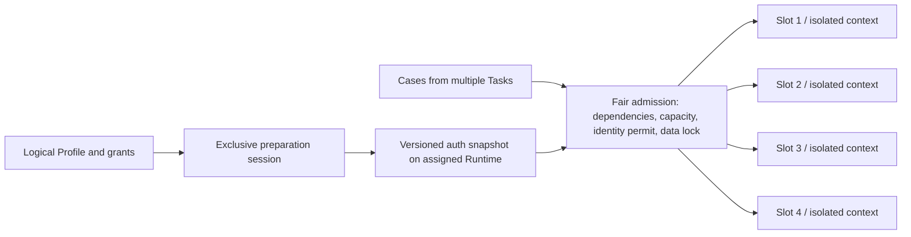

# Runtime concurrency, recovery, and queue visibility

Status: implemented in this working tree; production rollout remains a separate operation. Based on commit `c4a6322` and the production investigation on 2026-09-04, approximately 15:57–16:00 Asia/Shanghai. The implementation includes hierarchical resource locks and explicit Case policy/dependency review. Full model-history checkpoint/resume remains deliberately deferred; recovery creates a bounded new Attempt. See [upgrade instructions](upgrading.md) for activation and the disposable-database verification command.

## Implemented verification

The working tree includes the additive migration, Browser Runtime 0.2.17 / protocol v1.13, Agent protocol v2.10, API admission/recovery, Console controls, queue projections and operational metrics. Isolated authentication defaults off until deployment and Profile verification.

Local checks completed on 2026-09-04:

- `pnpm typecheck`, `pnpm test`, and `pnpm build` passed. Final API follow-up: 73 files / 437 tests; Browser Runtime: 19 files / 82 tests, including real Chromium context/process isolation, rotating authentication, control handoff, and stale permit/input rejection. One Chromium closure test timed out during the initial concurrent build/test run; its isolated retry and both subsequent complete test runs passed.
- `node apps/api/scripts/test-execution-concurrency.mjs`: 29 real PostgreSQL tests passed after applying the complete 56-migration chain to a disposable database. This covers 8 readers acquiring exactly 4 slots, conflicting/independent writes, writer readiness/fairness, duplicate acquisition, late-open ACK rollback, unknown-write quarantine, startup claim races and bounded recovery, HITL termination, and retrying failed cleanup after verified closure.
- Revoked owner epochs cannot renew or dispatch commands; unconfirmed closure holds resources. Audit-confirmed empty startup can release its reserved write lock; an uncertain write requires an atomic, audited human resolution.
- API, Agent and Browser Runtime deployment, the target domain's live authentication probe, and production rollout remain operational steps described in the upgrade guide. No production configuration was changed during implementation.

## Review corrections

The six review findings are addressed in this working tree:

| Finding                                         | Corrected behavior                                                                                                                                                                                                                                                                |
| ----------------------------------------------- | --------------------------------------------------------------------------------------------------------------------------------------------------------------------------------------------------------------------------------------------------------------------------------- |
| Expired startup at the queue head               | Claim filters invalid Sessions and rolls back/skips a candidate that changes during claim. Only a never-claimed Attempt can retry startup, once, after verified closure; its original deadline and budget remain intact. Stale recovery scans cannot close a replacement Session. |
| Intermediate HITL completion releases a write   | `WAITING_HUMAN` completion is not a final business outcome. Cancelled or expired writes remain isolated until verified empty or explicitly resolved. Cleanup failure after close remains retryable.                                                                               |
| Serial verification starts parallel auth probes | Parallel preparation requires an explicit option and feature flag. A failed probe refreshes and revalidates the source login before permitting serial use; an invalid source clears the snapshot and requires reauthentication.                                                   |
| Console release cannot resume the Agent         | A separate control generation fences takeover/release while preserving the running Agent epoch. Control expiry quarantines the Session for closure and policy-based recovery rather than reviving an expired permit.                                                              |
| An old expired permit kills a renewed Session   | Older expiry snapshots of the same active owner are ignored; actual registered lease expiry still revokes authority and cannot be revived.                                                                                                                                        |
| Admitted Cases lose their Agent wait reason     | ADMITTED counts as queued and retains AGENT_CAPACITY and waiting age across Task, Case and capacity views, with Run-based deduplication.                                                                                                                                          |

## Decision and intended behavior

Separate the reusable login identity from each executing browser session. Keep the persistent login directory exclusive, publish a versioned authentication snapshot on its Runtime, and create an isolated browser context for each admitted Attempt. Allocate Runtime capacity, identity concurrency permits, and business-data locks together. Recover expired Agent leases through bounded, visible Attempts after the old session has stopped.

For `test-duo.paigod.work`, eight independent, verified read-only Cases across two Tasks should use all four available slots on the assigned Runtime. Cases that edit the same server-side configuration must still wait for one another. Four is a node capacity limit shared by its work, not a guarantee that every group of four Cases is compatible.

This proposal deliberately changes the current “one Task per Profile” execution invariant only for a new, explicitly enabled isolation mode. Existing persistent execution retains its current semantics during migration.

## Evidence and problem boundaries

| Observed or verified fact                                                                                                                                                              | Consequence                                                                               |
| -------------------------------------------------------------------------------------------------------------------------------------------------------------------------------------- | ----------------------------------------------------------------------------------------- |
| The matching Runtime had capacity 4, occupied 1, available 3, and a node queue of 0.                                                                                                   | Raising the capacity cannot remove this bottleneck.                                       |
| The two Tasks used the same requester, hostname, and Profile scope. The second Task had no Runs; pending Cases had dispatch attempts 0.                                                | They were blocked before browser admission.                                               |
| Task-level Profile reservation, a same-Profile active-Run check, persistent-profile database lease, and Runtime directory exclusion all enforce serialization.                         | Removing only one scheduler check does not enable concurrent sessions.                    |
| The first PFRD-3450 Case was claimed eight times from 15:30 to 15:56, with fencing tokens changing while Attempt remained 1; stale-lease 409s and restarted execution traces followed. | Recovery repeatedly restarted the same Attempt without consuming the normal retry budget. |
| The first Run eventually reached `RUN_DEADLINE_EXCEEDED`. Current UI completion counts sum verdicts and omit terminal Runs whose verdict is null.                                      | A finished timeout can still appear as `0/4`; this is a counting defect.                  |

The initial reason for missed renewals is **not established**. Network faults, event-loop stalls, API/DB latency, and renewal races need instrumentation. A long asynchronous model request alone does not establish why heartbeats stopped.

Pre-change behavior in the investigated revision (the links now contain the implementation):

- [Profile reservation](../apps/api/src/task-executions/profile-reservation.service.ts): `acquire`, `reconcile`, and `releaseStaleActive` hold/renew a reservation at Task scope.
- [Task dispatch and counts](../apps/api/src/task-executions/task-execution.service.ts): `dispatchPending` skips blocked candidates without recording a reason; `executionCounts` conflates waiting and missing Runs.
- [Browser admission](../apps/api/src/verification/browser-admission.service.ts) and [session allocation](../apps/api/src/verification/browser-execution-runner.service.ts): existing fair admission and serializable slot allocation are the integration points.
- [Agent worker](../apps/agent-runtime/src/worker.ts) and [client](../apps/agent-runtime/src/control-plane.client.ts): interval heartbeats lack single-flight control and an explicit request timeout.
- [Agent task service](../apps/api/src/agent-runtime/agent-runtime-task.service.ts): expired `RUNNING` Tasks are claimable; heartbeat renewal checks ownership before an update by ID.
- [Browser executor](../apps/agent-runtime/src/browser-verification.executor.ts): a new execution initializes history, criteria, and tool budget again.
- [Browser Runtime](../apps/browser-runtime/src/index.ts): persistent directory exclusion is necessary; disconnected sessions currently have no local lease-expiry watchdog.
- [Runtime gateway](../apps/api/src/runtime/runtime-gateway.service.ts) and [lease sweeper](../apps/api/src/runtime/runtime-lease-sweeper.service.ts): expired sessions can lose their resource rows while `LOST` remains heartbeat-renewable. This is a verified state-machine risk, not evidence that an old browser performed writes in this incident.

## 1. Reliable ownership before wider concurrency

### Heartbeat and fencing

Introduce a shared lease manager for browser Agent execution. Initial tunable defaults are a 60-second lease, a 15-second renewal interval, a 5-second RPC timeout, and a 10-second safety margin. These are proposed defaults to validate, not measured production requirements.

- Allow at most one heartbeat in flight. Abort its request when execution ends. Transient network/5xx failures retry with jittered 1/2/4-second backoff while confirmed lease time remains.
- Use a monotonic local safety deadline derived conservatively from the server's lease lifetime and request elapsed time; do not rely on wall-clock agreement. Stop new tools before the confirmed lease expires. Typed `LEASE_LOST` and cancellation responses stop immediately.
- Renew with one conditional update that checks Task ID, owner, lease token, fencing token, `RUNNING` status, and an unexpired lease. Control-plane server timestamps define lease lifetimes; Runtime safety deadlines use monotonic elapsed time. An affected-row count other than one means ownership was lost. Progress, outcome, and deadline updates must also be conditional on the current owner.
- Keep heartbeat renewal cheap. Do not make successful renewal wait on model calls or expensive progress/deadline projection. Bound outcome submission too, and retain completion-ID idempotency.
- Log renewal latency/failure category, last successful renewal, worker process identity, event-loop delay, and reclaim cause. Do not log lease secrets.

### Expiry is a recovery transition

Remove expired `RUNNING` browser Tasks from the normal claim query. A recovery coordinator wins a CAS transition, invalidates the old Agent epoch, and records a durable recovery job.

```mermaid
stateDiagram-v2
    [*] --> Queued
    Queued --> Running: admitted and claimed
    Running --> Recovering: lease lost
    Recovering --> Queued: old session closed; safe retry; new Attempt
    Recovering --> Terminal: budget exhausted or deadline reached
    Recovering --> NeedsReview: write outcome unknown
    Running --> Terminal: completed, cancelled, or timed out
```



`Recovering` is a durable scheduling/recovery state; it need not force every existing public lifecycle enum to change. Recovery job identity is unique per Attempt and lost epoch, so repeated sweeps cannot create duplicate retries.

1. Reject old-epoch commands, events, outcomes, and releases. Record the execution owner on durable commands and recheck ownership before dispatch. New Attempts always use a new Agent Task, BrowserExecution, and Session.
2. Cancel queued/in-flight commands and request closure of the old session. A stale release targets only its original session/epoch; it cannot close a successor.
3. Bind execution permission to both the Agent epoch and the existing Session fence; permission cannot outlive either lease. A healthy Browser Runtime heartbeat cannot independently keep an abandoned Agent execution alive. Add a local watchdog with a monotonic deadline, and recheck permission before commands and human input. Disconnection pauses execution; expiry revokes the epoch and closes the browser/context. Reconcile persisted sessions before reopening after restart. Late ACKs must not revive a revoked epoch.
4. Change all API expiry/cleanup paths, including failed `session.close`, to quarantine unresolved sessions/resources. Remove `LOST` from ordinary heartbeat-renewable states; renewal must validate unexpired ownership and intact resource rows atomically. Deleting a database lease after its TTL is not evidence that the remote browser stopped. Release conflicting resources only after closure/reconciliation is established. A server request already accepted before closure may still have an unknown outcome.
5. For verified read-only work, create a new Attempt after cleanup. Initially allow at most one infrastructure recovery per Run, also bounded by remaining normal Attempt budget and the existing hard deadline. Never reset the Run's hard deadline on recovery.
6. For a possibly completed write, record `WRITE_OUTCOME_UNKNOWN`; require a reliable state check or human resolution before replaying or starting conflicting work. Exhaustion ends the Case with an infrastructure disposition, not a fabricated product assertion failure. Unrelated resources continue; dependent Cases wait or finish explicitly blocked according to their deadline/policy.

Human takeover needs its own explicit, bounded owner lease. Missing Agent heartbeats during intentional human control must not trigger an automatic browser restart. Explicit release before expiry advances the control generation and can resume the same live Agent. If the human control TTL expires, its permit cannot be revived: the Session is quarantined, Runtime reconciliation closes it, and the existing Agent recovery policy decides whether another Attempt is allowed. Conflicting write locks remain held until closure and business outcome requirements are satisfied.

Stopping Agent commands alone does not stop page timers or existing network connections. Give each session an identifiable proxy connection/socket set using the existing network-policy implementation; revocation rejects new traffic, closes active connections, and closes the browser. A watchdog on a stalled Node event loop is insufficient proof of remote termination. The first release keeps unresolved resources quarantined until closure evidence arrives; automatic release without that evidence would require a separate process watchdog and verified browser-process termination. Quarantine can outlive a Task's deadline, but the Task must finish or request intervention rather than silently renew forever.

Full browser checkpoint/resume is deferred. A later implementation must persist consumed budgets, completed criteria/evidence, pending operation IDs and results, and revalidate browser state. Restoring model history alone cannot safely resume a write or provide exactly-once execution.

## 2. Reuse authentication without sharing an executing browser



Add a Profile execution mode such as `SERIAL_PERSISTENT | ISOLATED_AUTH` and a per-identity session limit. Existing Profiles default to `SERIAL_PERSISTENT`. The assigned Runtime's capacity remains the final node limit; for the target pilot, the identity limit can also be four.

The logical Profile keeps its current owner, team, hostname/role scope, grants, inactivity policy, and Runtime affinity. Preparation, login refresh, snapshot publication, and deletion remain exclusive maintenance operations. In the first version, maintenance drains execution sessions before modifying login state, since reauthentication may invalidate their server-side sessions.

After successful login verification, Runtime exports authentication state and atomically publishes an immutable generation. The control plane stores only opaque references and metadata: Profile, Runtime, generation, compatibility/verification version, creation time, and optional expiry. Actual cookies and storage remain on that same Runtime under the existing Profile protections. They do not enter PostgreSQL, object storage, logs, prompts, or exported evidence.

Each Attempt pins one READY generation and opens a fresh context from it. Retain the current ephemeral implementation's one-browser-process-per-session initially; a shared browser-process pool is a separate optimization. Each session has its own page, context, evidence, network-fault state, lease, and fence. Test-time storage changes are discarded rather than merged into the source Profile.

Playwright supports bootstrapping isolated contexts with saved authentication state. Shared accounts are suitable when tests do not conflict through server-side state; account reuse does not isolate backend data. [Authentication guide](https://playwright.dev/docs/auth)

Explicitly export IndexedDB when required and supported by the pinned Playwright build. `sessionStorage` needs a separately specified, origin-scoped compatibility extension; do not assume it is included. Device-bound authentication, single-session login policies, and rotating refresh tokens require a domain-specific concurrent-login probe. Unsupported domains remain serial or use separately prepared accounts with real business-data isolation. [Storage-state API](https://playwright.dev/docs/api/class-browsercontext#browser-context-storage-state)

Revocation or expiry blocks new admission immediately. Snapshot refresh is single-flight per Profile, with bounded retries; other waiting Cases receive `AUTH_REFRESH` or `AUTH_REQUIRED`. Deletion disables admission first, closes affected sessions, and removes all snapshot generations. Inactivity cleanup must count isolated-auth use and protect generations pinned by active sessions. Never silently use unauthenticated mode or move state to another host.

Do not run four browsers against one persistent directory: Playwright explicitly disallows simultaneous instances using the same user-data directory. Opening four pages in one context also fails to provide the desired per-Case storage isolation. Copying a live directory is not the chosen design. [Persistent-context API](https://playwright.dev/docs/api/class-browsertype#browser-type-launch-persistent-context)

## 3. Schedule only compatible work

### Small first policy: environment-level reader/writer exclusion

Add immutable Case execution metadata with `accessMode: READ_ONLY | MUTATING | UNKNOWN`, a trusted `businessEnvironmentKey`, explicit dependencies, and policy provenance/version. Missing or unverified metadata is `UNKNOWN`; generated Case prose or HTTP method alone cannot grant shared-read eligibility. Initial read eligibility comes from reviewed templates or configured policy. Runtime observations of unexpected mutation should stop the Case and flag the policy, but cannot undo a mutation that already occurred.

| Declaration          | Initial lock                           | Compatible work          |
| -------------------- | -------------------------------------- | ------------------------ |
| Verified `READ_ONLY` | Shared lock on business environment    | Other verified readers   |
| `MUTATING`           | Exclusive lock on business environment | None in that environment |
| `UNKNOWN`            | Exclusive lock on business environment | None in that environment |

The lock namespace identifies the **actual shared backend**, for example a configured `test-duo/product-ops`. It must not use Task-specific `deploymentId`, Profile ID, owner ID, or a user-selected environment label. Domain aliases for the same backend map to the same key. Until configured, use a conservative normalized-origin scope. Team/tenant IDs may partition locks only when they represent real backend isolation.

Every DevProof execution path targeting a pilot environment must participate, including serial-persistent and unauthenticated work. Treat legacy work without policy as root-exclusive. Otherwise a legacy writer could bypass the new readers' locks. Before enabling the environment, drain preexisting executions that have no resource lease; if a path cannot participate, keep that environment serial. These locks coordinate DevProof executions, not arbitrary external users changing the same application.

In PFRD-3450, setting `officialModelNameVisible` to true and false can conflict. Model a prepare–verify–restore sequence as one exclusive execution unit, or declare explicit fixture/dependency boundaries; a dependency alone does not protect an intermediate state from another Task. The initial version treats those edits conservatively. The whitelist Task may also mutate shared state and must not automatically be labeled read-only.

Later, allow different resources to proceed using hierarchical root/collection/record locks and explicit fixtures. An unknown Case takes the root exclusive lock and conflicts with every child lease. A list-wide assertion must lock its collection or root. Separate accounts only enable independent writes when they also isolate the affected server-side data.

### Preserve two-stage dispatch; allocate resources together

Keep the current `dispatchPending → createRun → BrowserAdmissionService` architecture. In the new mode, dispatch validates authorization/policy and creates durable candidates without holding the Task Profile reservation or rejecting every same-Profile active Run. Creating a Run does not reserve execution resources.

Extend `BrowserExecutionRunner.allocateSession`, or extract a shared allocator, rather than distributing resource acquisition across stages. The short database transaction must:

1. Validate the admission token, current Attempt, cancellation/deadline, dependencies, Profile authorization, snapshot generation, and required Runtime capabilities.
2. Lock coordination rows in one canonical order; check Runtime slots, identity permits, and compatible business locks. Re-read the current capacity limit under coordination. A count followed by an unprotected insert is insufficient.
3. Create the OPENING Session, slot, identity permit, and data lease together. Bind `BrowserExecution.runtimeSessionId` and allocation generation in this same transaction; a crash must not leave an unowned session between allocation and association.
4. Commit all or none. Issue `session.open` outside the transaction. Mark ACTIVE through a generation-checked update only after opening succeeds. Agent claim remains gated on an admitted, active browser.

Concurrent allocators have one active allocation per Attempt. Repeated acquisition returns the same ACTIVE session or waits for its OPENING allocation. All entry points, including direct Agent acquire and maintenance sessions, share the relevant capacity/identity coordination; no path may bypass it.

Waiting candidates hold no slot, permit, or data lease. OPENING and “browser active, Agent not yet claimed” each have bounded startup deadlines. On failure, use the same recovery/cleanup path; an uncertain open is reconciled before reuse. After claim, valid Attempt activity owns renewal, not merely a nonterminal parent Task or an online node.

Retain Task round-robin fairness and scan past blocked candidates to fill available slots with compatible work. Once a writer has passed upstream checks and is recently evaluated as waiting for a data lock, later conflicting readers cannot continually overtake it. Writers blocked on login, dependencies, or an unavailable Runtime do not reserve data priority; stale eligibility expires without resetting original queue age. Keep durable queue age when retrying admission; poll timestamps must not reset priority.

Separate waiting and execution budgets: parent Task deadline bounds the whole request; admission has a bounded waiting deadline; Run execution budget starts at the first successful Agent claim. All retries inherit the initialized hard deadline. Precreating Runs must not consume every Case's execution budget while they wait. Startup waits remain separately bounded.

Represent the unstarted budget explicitly, for example with `queueDeadlineAt` and nullable `executionBudgetStartedAt`. At first claim, atomically initialize execution deadlines from the configured budget, capped by the parent deadline, and update the returned runtime snapshot. Before that transition, the effective deadline is the queue deadline. Update every deadline selector, sweeper, adaptive extension, and Task/Run projection to honor this distinction; merely adding a timestamp while leaving old timeout queries unchanged is insufficient. Existing Runs keep their original deadline policy through a versioned budget mode.

## 4. Explain every wait and count every terminal Case

Persist scheduling decisions when reason or blocker changes, and expose them through existing Task APIs. A compact contract is:

```ts
type Scheduling = {
  state:
    "READY" | "WAITING" | "ADMITTED" | "RUNNING" | "RECOVERING" | "TERMINAL";
  reason: string | null; // stable reason-code enum in contracts
  waitingSince: string | null;
  evaluatedAt: string;
  blockedBy: { resourceType: string; taskId?: string; runId?: string } | null;
  queue: { scope: string; position: number | null; snapshotAt: string } | null;
  nextRetryAt: string | null;
};
```

Reason codes cover legacy Profile reservation/session busy, identity limit, auth refresh/required, dependency, data lock, Runtime capacity/offline/incompatibility, retry backoff, Agent capacity, and lease recovery. Return blocker details only when the viewer can access them. Return queue position only within a scope with a defined ordering; mixed reader/writer/dependency scheduling does not have a truthful global position or ETA.

Separate exclusive phase counts (`queued`, `running`, `recovering`, `waitingHuman`, `terminal`) from verdict counts. Count planned `(caseId, deploymentId)` execution units, selecting the latest execution ordinal for each; do not collapse a multi-deployment task into distinct Case IDs. Every unit contributes to exactly one phase. Terminal includes timeout with null verdict, cancellation, dispatch exhaustion, and explicitly blocked/skipped completion. The numerator is terminal count, displayed as “已结束”, not “验证通过”.

For historical rows without scheduling metadata, derive phase from authoritative Run lifecycle, dispatch status/remaining attempts, and parent cancellation/deadline. A missing Run is not automatically waiting. If a planned unit has no execution row, derive its pending or terminal disposition from the parent and repair/materialize it through reconciliation. The API and UI share this classifier so legacy records do not fall out of the denominator.

A `LINKED` execution with no associated Run is a data-integrity error: expose and reconcile it explicitly rather than showing ordinary waiting or automatically dispatching a possible duplicate.

Example for the investigated snapshot, before enabling isolated sessions:

```text
Runtime：容量 4 · 执行 1 · 可用 3 · 槽位等待 0
上游等待：浏览器身份 7
PFRD-3551：等待浏览器身份；占用者 PFRD-3450 / Case 1
Case 1：恢复中；Attempt 2；本次 Run 已失租 1 次
超时结束后：已结束 1/4 · 超时 1
```

The Attempt 2 line illustrates the proposed recovery UI, not the historical Attempt-1 trace. Node `waiting` retains its historical meaning for compatible clients; add `runtimeWaiting` and upstream reason counts. Do not attribute unassigned/flexible waiting work to an arbitrary node. Profile resolution should say “已解析登录身份”, because resolution does not reserve a browser.

Trigger projection on terminal outcome, dispatch exhaustion/cancellation, recovery, and resource release. Use durable dirty-version/outbox updates with version-checked projection and retain periodic reconciliation. Expose projection freshness. Initial convergence target: P95 under two seconds and at most ten seconds under healthy operation; verify against worker cadence before setting alerts.

## 5. Delivery, compatibility, and acceptance

| Stage | Deliverable and primary code                                                                                                                                                                           | Exit condition                                                                                                |
| ----- | ------------------------------------------------------------------------------------------------------------------------------------------------------------------------------------------------------ | ------------------------------------------------------------------------------------------------------------- |
| P0a   | Heartbeat timeout/single-flight, atomic renewals, diagnostics; scheduling reasons and terminal counts. Agent worker/client/task service, Task projection, Console APIs/UI.                             | Transient heartbeat errors do not immediately restart a Case; every wait and timeout is explainable.          |
| P0b   | Durable bounded recovery, owner fencing, Runtime watchdog, safe cleanup/quarantine. Agent task service, unified browser service, command dispatcher, session sweeper, Browser Runtime.                 | An expired worker cannot interfere with a successor; no unlimited same-Attempt restart.                       |
| P1    | Local auth snapshots, isolated sessions, environment-level read/write policy, combined admission and queue/execution budgets. Prisma, contracts/protocols, Profile service, admission/runner, Runtime. | Eight compatible Cases across two Tasks reach four concurrent sessions; incompatible edits remain serialized. |
| P2    | Finer resource locks, explicit fixtures/dependencies, broader domain compatibility; checkpointing only if restart cost warrants it.                                                                    | Independent writes can run concurrently without weakening shared-state correctness.                           |

Suggested schema additions are Profile execution mode/limit, snapshot metadata, immutable Case policy, scheduling decision, execution-resource coordination/lease records, identity permits, recovery job/counter, and admission/owner generations. Keep lease ownership in resource tables rather than copying it into Case display fields. Snapshot content never becomes a schema field.

Use additive migrations and feature flags. Add negotiated Browser Runtime capabilities for auth snapshots and ownership-safe session execution; keep existing `PERSISTENT` and unauthenticated `EPHEMERAL` semantics. Add optional fields/capabilities with the next protocol minor under [the protocol rules](runtime-protocol.md), and document required Agent Runtime capability/version as well. API deployment alone cannot upgrade the independently installed Browser Runtime daemon.

Deploy schema and disabled capability support first, then compatible Runtime/Agent versions, then control-plane/UI logic. Drain or explicitly recover existing leases during activation; never switch an active Task's execution mode. Seed the first snapshot from an idle prepared Profile. Pilot only `test-duo.paigod.work` after its concurrent-auth probe passes. Stop new isolated admission to roll back, allow known sessions to drain, and return subsequent Tasks to the serial mode without deleting in-use state. Update [architecture](architecture.md), [Profile invariants](user-browser-profiles.md), protocol changelogs, and observability docs when implementation ships.

Required acceptance checks:

1. Inject one heartbeat timeout/503 and a slow RPC: no immediate restart, one in-flight renewal, and bounded request lifetime. Race renewal with expiry: one owner wins; stale owner gets no successful renewal.
2. Disconnect or pause a worker beyond its lease, including delayed command/release/heartbeat responses. A `LOST` session cannot revive through a heartbeat. Agent expiry revokes execution even while Browser Runtime heartbeats are healthy. Test page timers and open WebSocket/proxy connections, not just new tools; unresolved remote state stays quarantined rather than being called free.
3. Lose a write response after server acceptance: no automatic duplicate write. Exhaust recovery budget: Case terminates visibly, with unrelated work still progressing.
4. Run eight reviewed independent readers across two Tasks and one Profile on an otherwise idle four-slot node: reach four ACTIVE sessions, never five; four remaining Cases report the actual limiting reason. Measure time to fill against admission/startup cadence.
5. Verify context storage/page isolation and unchanged source snapshot; test token rotation/expiry, refresh single-flight, revocation, cleanup, and unsupported/older Runtime behavior.
6. Verify reader/reader concurrency, reader/writer and writer/writer exclusion across Profiles and Tasks targeting the same backend, unknown-case root exclusion, dependency ordering, and no writer starvation.
7. Race multiple schedulers, crash after allocation and before opening/association, and cancel during opening. No duplicate session, leaked permit, or early release of uncertain resources.
8. Queue several Cases before admission: waiting does not consume execution budget; every retry still shares the Run's original hard deadline and remaining Attempt budget.
9. Timeout with null verdict, cancel without a Run, and exhaust dispatch retries: terminal counts are correct and sum with other phases to total. Include historical rows without new metadata, multiple deployments, and broken Run associations. Projection converges after repeated events/restarts.

Monitor heartbeat latency/failures, event-loop delay, lease loss and recovery counts, stale-command rejection, unresolved cleanup age, configured/occupied/quarantined slots, eligible backlog, wait duration by reason, and projection lag. Keep Task/Profile/Run IDs in logs and traces, not metric labels. Alert on idle capacity with eligible compatible backlog beyond the admission/startup budget; identity or data-lock waits should identify their bottleneck instead of reporting a capacity failure.
