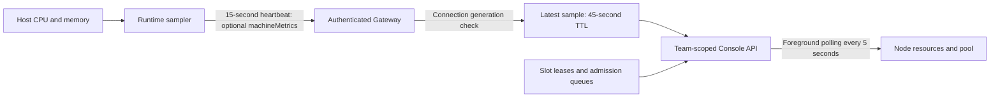

# Browser Runtime machine and pool observability

## Existing pairing and admission

1. Console issues a single-use, team-scoped pairing token valid for ten minutes.
2. `pair` registers the installation by `teamId + instanceKey`. The API stores a credential hash; the machine retains the credential in `runtime.json`. Pairing an existing installation preserves its configured concurrency.
3. Runtime opens an outbound WebSocket, authenticates through hello, negotiates a protocol minor, receives a new connection generation, and reconciles sessions. Redis holds expiring connection presence.
4. `DEVPROOF_MAX_CONCURRENCY` sets initial registration capacity. Console's persisted `maxConcurrency` subsequently controls admission; heartbeats cannot overwrite it.
5. Routing, Profile affinity, and protocol requirements determine eligible nodes. The allocator checks capacity under database coordination and acquires slots, identity permits, and applicable data leases together. Waiting candidates hold no slot.
6. Opening, active, human-controlled, and unverified quarantined sessions can occupy capacity. Reducing the configured limit does not forcibly close existing sessions; excess occupancy drains as sessions release their resources.

Implementation entry points are `apps/api/src/console/browser-runtime.service.ts`,
`apps/api/src/runtime/runtime-gateway.service.ts`,
`apps/api/src/runtime/runtime-sessions.service.ts`, and
`apps/browser-runtime/src/index.ts`.

**1–32 is the configuration range, not a measured machine capacity.** Page
complexity, Chromium memory, screenshot/video processing, other host processes,
shared identities, and business-data locks all affect throughput.

## Telemetry path

### Measurement definitions

| Metric                            | Meaning                                                                                                                                                                                                           |
| --------------------------------- | ----------------------------------------------------------------------------------------------------------------------------------------------------------------------------------------------------------------- |
| CPU utilization                   | Difference between successive cumulative CPU counters, normalized across all logical CPUs to 0–100%. Warmup, counter resets, CPU topology changes, and long sampling gaps yield an unknown value instead of zero. |
| Memory utilization                | `(total - available) / total`. Linux uses `/proc/meminfo` `MemAvailable`, including reclaimable caches. Other systems and restricted procfs installations use `os.freemem()`; the UI labels the source.           |
| Runtime process memory            | Node.js RSS only, shown as supplemental information. It excludes Chromium child processes and must not substitute for host memory usage.                                                                          |
| Configured / occupied / available | Existing server-side capacity accounting. Offline nodes have zero schedulable availability.                                                                                                                       |
| Quarantined                       | Sessions whose physical closure remains unverified. Quarantined slots are included in occupied capacity, not added to it.                                                                                         |
| Slot waiting                      | Admission has explicitly returned `NO_AVAILABLE_SLOT`. Pinned work counts toward its node; unassigned work appears only in the team pool.                                                                         |
| Upstream waiting                  | Identity limits, Profile reservations, data locks, dependencies, Agent capacity, and other reasons remain separate. Increasing node concurrency may not unblock them.                                             |

The slot squares illustrate aggregate capacity; they do not identify physical
slot numbers or session IDs. Measurements use **host scope**. This version does
not collect cgroup limits; container deployments must also check their CPU and
memory quotas before increasing concurrency.

### Freshness and failure handling

- Freshness uses the server receipt timestamp rather than the Runtime's wall clock.
- Only a current authenticated connection can publish metrics. Redis atomically updates presence and telemetry after comparing decimal connection generations without floating-point truncation. Older connections cannot overwrite newer generations.
- Readers check that the sample belongs to the current presence owner. The cache works across API replicas; reconnect, disconnect, and TTL expiration invalidate previous samples.
- Disabled, revoked, offline, legacy, missing, and expired states do not appear as fresh zero utilization.
- Collection failures and malformed optional metrics discard telemetry without invalidating the session heartbeat or lease renewal.
- The page polls only node and capacity endpoints. Hidden pages and other access categories pause polling. Each polling batch finishes before another starts; failures retain the previous snapshot and show its last successful refresh time.
- New node object references from polling do not reset unsaved concurrency or allowlist drafts. Registration ordering keeps heartbeat updates from shuffling node cards.

## Choosing concurrency

Increase concurrency gradually with representative tasks. Observe complete
execution cycles, including screenshot/video peaks, while comparing CPU,
available memory, slot waiting, and task duration.

- Full slots, actual slot waiting, and resource headroom justify a small increase followed by observation.
- Sustained resource pressure or increasing task duration calls for reducing concurrency or adding capacity.
- Free slots with identity, data, or dependency waits call for resolving those scheduling constraints.
- Quarantined sessions require the recovery workflow before their resources can be reused.

The UI's 85% resource-pressure hint is a heuristic, not a hardware capacity
model. Admission remains manually configured; a single sample never determines
an automatic maximum or changes scheduling limits.

## Compatibility and rollout

Protocol v1.18 adds optional `runtime.heartbeat.machineMetrics`. Runtime sends it
only after negotiating minor 18 or later. Older nodes continue operating and
show an upgrade hint. Deploy API/Web and upgrade and restart Browser Runtime to
receive actual machine measurements. No database migration or re-pairing is
required.

This implementation retains the latest sample only. It does not provide
long-term time series or a benchmark-derived capacity estimate.

## Verification

- Protocol compatibility and malformed-sample handling: `packages/runtime-protocol/src/machine-metrics.spec.ts`.
- CPU intervals, Linux available memory, collection failures, and negotiated sending: `apps/browser-runtime/src/machine-metrics.spec.ts`.
- Current connection checks, team scoping, and configuration ownership: Gateway and BrowserRuntimeService unit tests.
- Cross-replica reads, stale-generation rejection, and TTL: `pnpm --filter @devproof/api test:redis-presence`, using an isolated Redis without persistence.
- Live updates, draft preservation, legacy/offline/stale/error states, paused polling, and desktop/mobile layout: build Web, then run `node scripts/test-runtime-observability-ui.mjs`. This uses mocked APIs and does not access bound machines.
- Existing recovery UI regression: `node scripts/test-runtime-recovery-ui.mjs`.
