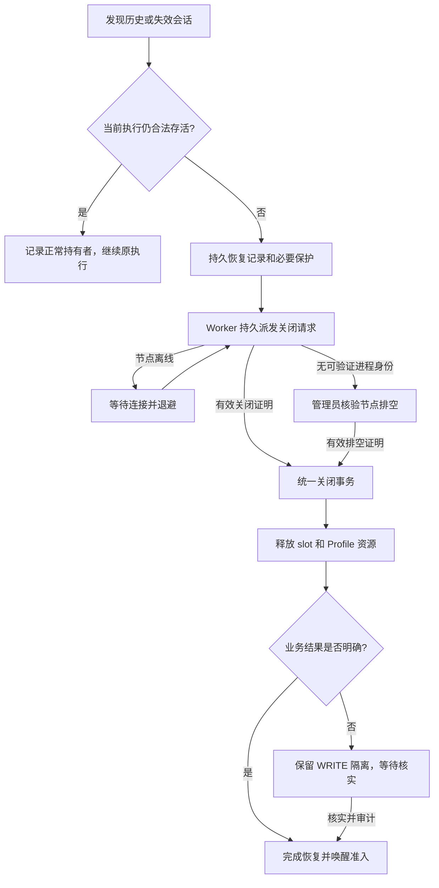

**DevProof 历史会话阻塞完整修复方案**

状态：已在本地实现并验证，尚未部署。日期：2026-09-05。修复分支 `fix/session-closure-recovery`，以实际部署提交 `d8901e6156fca742a0e89dc2b4607aa22e66d0a4` 为事故分析基线；提交 PR 前已同步 `main` 的 `d2b38ec22b35d9519e2de064217326cb786d2ebe`。监测保持暂停；线上任务及历史数据本轮未修改。实际接口、开关和上线步骤见 [实施与上线说明](session-closure-recovery-implementation.md)。下文保留完整设计与验收边界；与初始提案的取舍在实施说明中明确。

事故根因调查基于线上快照与 10 项本地复现；原始诊断材料保存在受控的本地调查记录中，不随仓库发布。线上直接命中历史会话 DATA_LOCK 分支已确定；具体阻塞行的协议版本、旧 Runtime 与进程状态因导出脱敏尚未取得。下面的修复同时覆盖旧协议残留、现代关闭失败、重启未验证、无关联 Run 的会话，不以“线上必然是协议 1.12”作为前提。

**1. 目标与必须保持的约束**

目标：每个异常阻塞会话都有可追踪的恢复记录，能自动安全关闭的最终收尾，不能自动证明的明确进入人工处理；业务结果未核实的写入继续受保护。任务可以正常推进、明确等待或按原截止时间结束，不再只循环准入而无人处理旧会话。

必须保持以下约束：

1. 租约过期、槽位空闲、状态 LOST、daemon 重启和本地库存为空都不是通用的物理关闭证明。
2. 关闭证明匹配 Runtime 归属、会话 lease/fencing 和可信进程范围；旧连接、旧 epoch 不能释放新会话的资源。
3. 关闭单向推进。已确认关闭不被迟到失败改回 LOST，不清空已有 closureVerifiedAt。
4. 物理关闭与业务写结果分别记录。`CLOSED + WRITE_OUTCOME_UNKNOWN` 是合法状态：可以释放物理资源，必须保留冲突数据保护。
5. 从历史保护切换为新租约保护的过程没有空窗；已核实的写结果不会被迟到事件重新隔离。
6. 健康的 ACTIVE/HUMAN_CONTROL 会话不能仅因“被新请求挡住”而遭后台终止。
7. 恢复不延长原 Task/Run deadline，不复活已终态任务，不自动重放结果不明的写操作。
8. 所有在线副本先具备兼容保护，再启用新恢复语义；回滚不删除证据、隔离记录或必要租约。

首轮保留 SERIAL_PERSISTENT 的占用规则。解除 QUEUED Profile 预占涉及另外一套调度互斥，不作为关闭修复的捷径。知识库配置问题也不属于这条恢复链的实现范围。

**2. 总体结构与唯一写入入口**

新增三个职责明确的服务：

| 组件                   | 职责                                                                     |
| ---------------------- | ------------------------------------------------------------------------ |
| SessionRecoveryService | 发现、分类、幂等建立恢复记录；维护关闭与写结果两个状态；处理人工动作     |
| SessionRecoveryWorker  | 多副本 claim、持久命令派发、退避重试、离线等待、人工升级                 |
| SessionClosureService  | 唯一的关闭证明验证和关闭事务入口；其他组件不得自行填写 closureVerifiedAt |

沿用现有 execution_resource_leases 表做真实资源互斥；恢复表管理流程，不建立另一套并行的锁判定。现有 gateway、lease sweeper、Run cleanup、Agent recovery、Console close 都转为上述服务的调用方。



统一入口必须替换的调用点：

- browser-execution-runner.releaseForExecutionRun 的成功/失败写入。
- RuntimeSessionsService.close、closeIdleProfileSessions 等直接关闭路径。
- dispatcher 的 session.close result 与 SESSION_INTERRUPTED event。
- gateway.finalizeMissingClosedSessions 及重启 reconcile。
- session-resource-cleanup、过期槽位清理及 Agent 恢复涉及的关闭判断。

特别修正：[修复基线中的 helper](https://github.com/ethanyu-dev/devproof/blob/d8901e6156fca742a0e89dc2b4607aa22e66d0a4/apps/api/src/runtime/session-resource-cleanup.ts) 允许凭 status=CLOSED 放行，随后补写 closureVerifiedAt；新逻辑必须要求有效证明，不能从状态推导证明。现有历史 CLOSED/null 数据保留历史语义，不批量重新制造全局阻塞，也不伪造证明时间；当其仍持有资源、需要新恢复动作时进入明确的核验流程。

**3. 数据模型：关闭、写结果与 Worker 所有权分别保存**

新增 `RuntimeSessionRecovery`（建议字段，名称以实施时仓库规范为准）：

| 字段组       | 字段与含义                                                                                                            |
| ------------ | --------------------------------------------------------------------------------------------------------------------- |
| 目标         | id、teamId、runtimeId、sessionId、expectedSessionFence、expectedLeaseDigest；唯一键 (sessionId, expectedSessionFence) |
| 来源         | reason、observedProtocolMajor/Minor、discoveredAt、sourceRunId（可空）                                                |
| 关闭         | closureState、closureEvidenceId、closureVerifiedAt；证明只由统一服务写入                                              |
| 写结果       | writeOutcomeState、outcomeEvidenceRefs、resolvedBy、resolutionNote、writeResolvedAt                                   |
| 保护范围     | scopeSnapshot、scopeProvenance、aliasRegistryVersion；记录已知环境或通配符来源                                        |
| 重试         | attempts、nextAttemptAt、lastErrorCode、lastErrorAt、activeCommandId                                                  |
| Worker claim | claimToken、claimExpiresAt、claimVersion；与浏览器会话 fence 独立                                                     |
| 并发与终态   | version、resolvedAt、createdAt、updatedAt                                                                             |

`closureState`：
`OBSERVED → REQUESTED → CLOSING → VERIFIED`；
CLOSING 可转 RETRY_WAIT、WAITING_RUNTIME 或 NEEDS_OPERATOR；
相应条件变化后重新进入 REQUESTED。VERIFIED 为吸收态。

`writeOutcomeState`：
`UNASSESSED | NOT_APPLICABLE | UNKNOWN | NO_WRITE_VERIFIED | CONFIRMED | RESOLVED`。
其中 NO_WRITE_VERIFIED 必须有完整启动/命令审计和禁网执行许可证据；CONFIRMED 为可信最终业务结果；RESOLVED 为人工记录业务核实后的终态。关闭证据不能自行把 UNKNOWN 改成这些状态。

整个恢复完成当且仅当：
`closureState=VERIFIED` 且写结果为 NOT_APPLICABLE、NO_WRITE_VERIFIED、CONFIRMED 或 RESOLVED。
OBSERVED 仅用于已发现的合法持有者，不进入关闭任务 claim。

新增 `SessionClosureEvidence`：evidenceId 唯一、recoveryId、requestId、sessionId/fence/leaseDigest、runtimeId、connectionGeneration、host/daemon/launch 身份、method、能力版本、证据摘要、serverVerifiedAt、actor/auditRef。原始凭证、cookie、leaseToken 不进入日志或前端证据；协议必须携带的令牌只在受认证传输与现有受控命令存储中处理。

扩展现有表：

- BrowserRuntime：connectionGeneration、connectionId、hostInstanceId、daemonInstanceId、drainGeneration/drainState。连接身份与进程/宿主身份不能混为一谈。
- BrowserRuntimeSession：closureEvidenceId；新启动记录 launchIdentityVersion/launch identity 摘要。不要靠修改旧 protocolMinor 宣布关闭或补足旧审计。
- ExecutionResourceLease：可空 recoveryId、origin（NORMAL/LEGACY_RECOVERY）、guardReason。历史 guard 不得被普通“无命令记录”分支删除。
- BrowserExecution：可空 blockingRecoveryId，用于定向唤醒和追溯。
- TaskCaseExecution：可空 dispatchOrder，保存生成时顺序快照。
- RuntimeRecoveryOutbox：内部 REQUEST_CLOSE/RECOVERY_CHANGED 事务事件；唯一键 (recoveryId, eventType, version)，包含命令/受影响资源引用、派发 claim 和 deliveredAt。不要把内部恢复唤醒写进对用户发送通知的 NotificationOutbox。
- RuntimeRecoveryPermit：runtimeId 唯一，绑定当前 recoveryId、activeCommandId、claimToken/ExpiresAt，用于跨副本限制同节点的恢复派发；不能把逐恢复行的 SKIP LOCKED 当作节点级互斥。

必要索引：恢复队列 (closureState,nextAttemptAt,id)、(runtimeId,closureState)、(teamId,resolvedAt,updatedAt,id)、(claimExpiresAt)；blockingRecoveryId；证据 requestId 与唯一 evidenceId；outbox 待发送索引。新表先加，旧列均可空；大表索引按部署工具支持采用分批或独立在线建索引步骤，避免长时间 DDL 阻塞。

**4. 历史会话恢复：按可验证事实选择路径**

| 会话/节点情况                                                            | 处理方式                                                                    |
| ------------------------------------------------------------------------ | --------------------------------------------------------------------------- |
| 合法 ACTIVE/HUMAN_CONTROL，执行 owner、许可、deadline、节点 epoch 均有效 | 保留运行；OBSERVED 或正常 DATA_LOCK；不给自动关闭指令                       |
| 旧协议会话，现代节点仍持有匹配 epoch 的 live browser 对象                | 真正关闭，生成新式证明                                                      |
| 旧协议会话，有可信且受支持的进程/容器标识                                | 关闭并核验完整进程范围，再生成证明                                          |
| 旧描述缺少 processIdentity，只有 session UUID/空清单                     | NEEDS_OPERATOR；现代 marker 扫描为空不能证明旧进程不存在                    |
| 节点离线                                                                 | WAITING_RUNTIME；保留保护，重连时唤醒                                       |
| 节点已被可信基础设施关闭/销毁                                            | 通过受控 drain 证明处理冻结的会话集合                                       |
| FAILED/LOST/CLOSING 或 terminal Run 的残留会话                           | 按上述证据能力分类恢复，不能因状态名称不同漏选                              |
| 无关联 Run/Agent 的历史会话                                              | 以 session 为恢复主键，不能依赖 BrowserExecution 存在                       |
| 会话从未成功分配，只有终态 Run 的等待记录                                | allocation CAS 核验后直接收尾；不能凭 runtimeSessionId 为空判断没有在途分配 |

发现来源包括：迁移分批扫描、周期扫描、准入记录的 blocker、租约撤销、Run 终态、节点 reconnect 和显式关闭。准入事务返回 blocker 后，由独立事务 upsert recovery，避免在随后抛异常回滚的准入事务里“入队成功”；周期扫描兜底保证无请求触发时也能发现。

扫描本身只分类，不根据新任务的等待强制终止健康旧会话。对 LIVE 但 lease/owner 已失效者先持久撤销权限，再执行关闭恢复。

**5. 关闭协议与连接可信边界**

建议新增 `closure-evidence-v1` 能力，基于当前协议 1.13 发布下一兼容小版本（设计记为 1.14，实施时检查版本占用）。沿用 session.close 命令类型，增加可选 recovery 请求结构；旧客户端继续使用旧消息，新能力只有本次连接协商成功才发送。

gateway 向 dispatcher/closure service 传入服务端构造的上下文：

```ts
type AuthenticatedRuntimeContext = {
  runtimeId: string;
  connectionId: string;
  connectionGeneration: bigint;
  negotiatedMinor: number;
  capabilities: ReadonlySet<string>;
  hostInstanceId?: string;
  daemonInstanceId?: string;
};
```

capabilities 取本次握手，不使用数据库曾经合并过的能力作为证明。现有 instanceNonce 每次 reconnect 随机变化，不是 daemon 或 host 的稳定身份证据。将 token 复制到另一台主机后重新注册，不能由新主机证明旧主机进程已退出。

关闭请求包含：
`recoveryId / requestId / sessionId / expectedLeaseToken / expectedFencingToken / expectedLaunchIdentity`；
requestId 由服务端持久创建，是对应关闭操作的 challenge。

关闭证明包含：
`evidenceId / recoveryId / requestId / sessionId / leaseToken / fencingToken / hostInstanceId / daemonInstanceId / launchIdentityVersion / method / networkRevoked / closureCompletedAt`。
method 首期为 LIVE_SESSION_TERMINATED、IDENTIFIED_PROCESS_SET_TERMINATED、ADMIN_DRAIN_ATTESTATION。节点时间只作审计，排序和 verifiedAt 使用服务端时间。

节点的证明顺序：

1. 持久撤销指定 session epoch 的后续启动/执行权限；关闭途中到来的 session.open 或辅助启动不能重建它。
2. 关闭该会话网络代理、连接和浏览器上下文，等待在途启动结束，核验主进程及辅助进程范围已退出。
3. 持久化 closure tombstone 与可靠 outbox，再回复证明；本地证据持久化失败不能返回 VERIFIED。
4. 录像最终合成与物理关闭分开：录像失败作为证据产物错误，不应否认已经证明的进程退出；进程残留或网络撤销不完整不能当关闭成功。

关闭请求是幂等的。请求超时不等于关闭未执行；迟到的有效证明仍可完成同一 session epoch 的关闭，不因 Worker claim 过期而丢弃，也不需要把原 command TIMED_OUT 改回 SUCCEEDED。业务命令的正常 lease/deadline 校验不因此放宽。

旧 1.13 兼容适配器采用明确资格条件：新 API 留有原始创建和 close 派发记录、创建/关闭发生于同一已认证连接 generation、session epoch 与 commandId 精确匹配、所运行的已核验 Runtime 构建具有完整 launch-marker/进程退出语义。其成功 close 结果可由服务端关联 commandId 生成兼容证明，proof 类型与新协议区分。storedMinor>=13、localClosureVerified=true 本身均不满足条件。缺少原始创建证据的既有行、跨连接/宿主的旧事件，只作线索并转主动新协议或人工核验；兼容资格不足可以等待，但不能无证据放行。

对于库存缺失，不再直接写 closureVerifiedAt；将其作为主动核验线索。需要保留现代库存推断时，必须先证明对应 launch 范围完整受控且已经撤销，而非仅检查数组中无 ID。

**6. 连接代际、多副本与重放**

hello 在数据库中原子推进 connectionGeneration，Hub 本地映射保存 socket + generation。证据事务锁住 Runtime 行核对 generation，再核对会话归属与 epoch。

Redis DELIVER、DISCONNECT_OLDER_GATEWAYS、presence 和 socket OFFLINE 更新都携带 generation；删除 presence 使用比较后删除的原子操作。旧 socket 的关闭回调只能移除自己的连接，不能把同一实例上的新连接标成 OFFLINE；延迟的断连广播也不能关闭更高 generation 的连接。

旧连接在途消息被替换后拒绝。持久证明经新连接重放时，重新 challenge 并核验同宿主/启动范围 tombstone，或按受支持的恢复凭据重新认证已有证明；不得直接把旧消息换一个 generation。未能认证的证据保留待处理并重试真实核验，不释放资源。

Worker claim 使用短 PostgreSQL 事务和 FOR UPDATE SKIP LOCKED，按 nextAttemptAt/id 取数。进程内 running 标志不能替代分布式 claim。claim 过期只转移执行权，不推断旧 RPC 的结果。

同 Runtime 的派发还必须原子取得 RuntimeRecoveryPermit；多个副本不能分别领取同节点不同 session 后同时派发。接管者优先恢复 permit 绑定的在途命令，单纯 claim 过期不授权改派另一会话。节点侧关闭队列串行且按 requestId 去重，避免旧 RPC 尚未完成时由另一副本造成并发关闭风暴。

首批参数与后续运维目标（实际生效值和实现边界见实施说明）：

| 项目                    | 初始值                                                                    |
| ----------------------- | ------------------------------------------------------------------------- |
| 每轮 claim              | 20 条，按 Runtime 限流，并行关闭每 Runtime 至多 1 条                      |
| close RPC deadline      | 90 秒；与录像上传解耦                                                     |
| Worker claim TTL / 续租 | 120 秒 / 30 秒                                                            |
| 暂态失败退避            | 5、15、30、60、120 秒，之后封顶 120 秒，±20% 抖动                         |
| 自动失败升级            | 6 次失败进入 NEEDS_OPERATOR；持续 10 分钟专项告警为后续目标               |
| 已知缺乏进程身份        | 立即 NEEDS_OPERATOR，不做无意义的同类 RPC 重试                            |
| 纯离线                  | 不累计已发送关闭失败次数；120 秒重试或在线事件唤醒，10 分钟告警为后续目标 |

先提交恢复记录、activeCommandId 和 outbox，再发网络请求。接管 Worker 先检查原命令/证明；未决则重发或等待同一 commandId。只有上一请求终结且没有有效证明，才创建下一 requestId。任何网络等待都在资源锁/行锁事务之外。过期 claim 的失败结果不能覆盖新任务状态；有效成功证明则独立按会话 epoch 校验。

终态 Run 的清理改为幂等请求恢复，恢复生命周期可以超出 Run 截止时间。LOST/FAILED/RELEASING、无 Run 残留均由恢复队列覆盖；ALLOCATING 先撤销 allocationToken 并核验分配是否提交，发现会话后转恢复，避免与迟到分配互相覆盖。

**7. 统一关闭事务与写保护**

锁顺序在所有相关写路径中一致：
`browser-execution-resources advisory lock → Runtime row → Session row → Recovery row → Agent/资源相关行`。
Worker claim 事务也持久化命令及其 session 关联，因此先取得资源 advisory 锁，再读取和认领候选，不能反向获取资源锁；批量操作按稳定 ID 排序。更新 owner 的关联事务也须审计锁序，防止与 Agent recovery 形成反向等待。

以下为逻辑顺序，实施时使用数据库事务/CAS，而非把 RPC 放进事务：

统一入口接收 `RuntimeProofContext | AdminDrainContext` 判别联合。前者校验当前认证连接、generation和能力；后者校验当前管理员权限、drain冻结集合/代际及可信宿主排空证据，不要求旧节点仍有在线 socket。两者共用后续 epoch、guard、单调关闭和审计事务。

```text
submitClosureEvidence(context, proof):
  1. 按证明类型校验Runtime连接或管理员drain上下文；核对Runtime归属、已登记request、session lease/fence。
  2. 相同已提交evidence幂等返回；冲突evidence审计拒绝。
  3. 重读业务核实终态，已RESOLVED绝不重建数据guard。
  4. 为需要保护的旧无租约EXECUTION物化根级WRITE guard。
     已知目标按既有alias规则取root；未知保持 *。
  5. 持久证据；CAS 未确认关闭 → CLOSED + closureVerifiedAt + evidenceId。
  6. 仅删除匹配该session/fence/lease的slot、profile lease、控制许可。
  7. 依据独立writeOutcomeState释放READ或已核实资源；
     UNKNOWN的WRITE guard继续quarantined。
  8. 更新恢复投影与BrowserExecution，不改写业务验收结论；
     写审计和内部唤醒outbox，一起提交。
```

历史 guard 可在明确失效的恢复请求建立时提前物化；关闭事务必须再次兜底核验。物化与准入使用同一 advisory lock，确保始终存在“旧保护或新 guard”。

已有现代隔离租约也要被恢复流程接管：在同一资源锁事务内，将目标 session/epoch 的既有租约关联 recoveryId，保留原 root/resource/mode/origin，不能只处理新增 LEGACY_RECOVERY guard。核实后应删除该恢复拥有且已获准释放的所有相关租约；不得遗漏 recoveryId 原为 null 的 NORMAL 隔离租约，也不能影响其他会话。

不要依据旧会话当前 protocolMinor 或命令表为空认定无写入。旧版本可能没有完整审计，新节点升级不能补齐过去的事实。只有有证明的“禁网 STARTUP、未授权执行、完整记录”才可 NO_WRITE_VERIFIED；历史 UNKNOWN 默认待核实。

关闭失败处理也走统一服务，CAS 包含目标 epoch、当前 request/version 和 closureVerifiedAt=null。绝不无条件 update({id}) 回写 LOST。已经成功关闭的会话收到迟到失败，仅记录尝试失败，状态和证明保持不变。

人工业务核实与删 guard 必须在同一事务内：

- 核验可信关闭证明、关联 owner/Run 已停止、请求者权限、expectedVersion 与 Idempotency-Key。
- 保存明确 outcome、核实说明、证据引用、actor 和 writeOutcomeState=RESOLVED。
- 同步适用的 Agent recoveryStatus，删除该 recovery 的保护租约。
- 写审计和 outbox；重复请求返回原结果，冲突版本返回 409。
- 迟到 close、重连或扫描看到 RESOLVED 后不可重新创建 guard。

未知目标的通配符保护只能依据核验过的历史目标/基础设施映射缩小，不能为了让队列运行而把它改成当前任务域名。

**8. 无进程身份时的管理员排空流程**

新增 RuntimeDrainOperation，记录 runtimeId、drainGeneration、冻结会话 epochs、宿主不可变标识、请求者和状态。准入事务检查 drainState；drain 开始与分配使用同一资源锁，保证冻结集合完整。普通用户的“请求恢复”不能触发整机排空。

管理员先取得恢复计划预览，再执行：

1. 禁止该节点新准入，停止已失效会话；合法活跃任务必须正常结束或由管理员明确取消后再排空。
2. 停止旧 daemon 并防止 supervisor 自动重启；关闭专用容器/service cgroup/VM 对应的浏览器与代理进程范围。
3. 记录可信基础设施的证明：专用容器不可变 ID 已删除、专用 cgroup 为空且服务已停止，或原 VM 已关闭/销毁。
4. 服务端检查冻结 epochs、drainGeneration、期间无新分配、管理员权限和证据引用，再按冻结集合提交 ADMIN_DRAIN_ATTESTATION。
5. 浏览器关闭后继续保留未知写结果 guard；待业务核实后释放。重新启用节点单独执行，不隐式恢复原会话。

缺少专用隔离范围或可信宿主身份时，停在 NEEDS_OPERATOR。仅填写“已重启服务”、换新节点、清空状态文件或库存为零，都不能批准关闭。首期允许受控 ADMIN 人工证明，明确标记为人工核验，不伪称机器验证；后续再接可信基础设施证明提供方。

**9. API、页面与权限**

所有路径相对于现有 `/console/api`：

| 接口                                                      | 行为                                                                                              |
| --------------------------------------------------------- | ------------------------------------------------------------------------------------------------- |
| GET /runtime-recoveries?state=&cursor=                    | 分页恢复列表，按权限显示历史无租约记录与现有隔离                                                  |
| GET /runtime-recoveries/:id                               | 会话/旧Run/Runtime/范围/关闭与写状态/等待年龄/错误/尝试/证据摘要                                  |
| POST /runtime-sessions/:id/recovery                       | 幂等请求恢复；健康 holder 返回 OBSERVED，不关闭健康执行                                           |
| POST /runtime-recoveries/:id/retry                        | 条件变化后的受控重试；不跳过证明、退避和epoch校验                                                 |
| GET /runtimes/:id/drain-preview、POST /runtimes/:id/drain | 管理员查看影响、创建节点排空；提交预览 snapshotDigest                                             |
| POST /runtimes/:id/drain/:drainId/attest                  | 提交 snapshotDigest、幂等键、基础设施终止确认及审计证据；拒绝普通成员                             |
| POST /runtime-sessions/:id/resolve-write-outcome          | 保留旧路由，新版本扩展 outcome/evidenceRefs/expectedVersion/Idempotency-Key，调用统一业务核实事务 |

旧 GET /runtime-quarantines 保留数组形状，数据源扩大为旧隔离与未解决恢复的去重并集；保留 id/status/closureVerifiedAt/browserExecutions，新增字段可选。新的完整页面使用分页接口。

旧 resolve-write-outcome 的 note-only 请求可由兼容适配器转换为“人工已核实，详细结果在note”，仍要求关闭证明、管理员权限、当前状态CAS和审计；对于缺少必要证明的新场景返回明确409，不再走旧删除逻辑。新客户端必须发送结构化 outcome/version/idempotency key。

鉴权：现有 AuthContext 没有 role，不能只检查已登录或在前端隐藏按钮。读取沿用团队隔离；恢复/写结果核实/节点排空在服务端查询当前有效 TeamMembership.role=ADMIN，并校验目标属于同团队。若已有资源级授权更严格，则同时满足。跨团队冲突只显示受限关联标识和“共享环境存在待恢复执行”，不返回另一团队的 session/Run/目标 URL。

列表区分“合法执行仍在运行”“等待节点”“自动关闭重试”“需要排空核验”“关闭已确认，写结果待核实”“恢复已完成”。排队页显示直接原因与根本原因，例如“等待身份：前一个 Run 正在等待旧会话恢复”。展示最近状态变更，不把每一次重复检查刷进时间线。

[修复基线中的 Run 文案函数](https://github.com/ethanyu-dev/devproof/blob/d8901e6156fca742a0e89dc2b4607aa22e66d0a4/apps/web/app/console/runs/runs-client.tsx) 改成 lifecycle 穷尽映射：QUEUED=排队中，PREPARING=准备执行，RUNNING=执行中；只有终态才能显示结束，未知状态显示“状态待确认”。startedAt为空不展示已执行结论。

导出保持凭证脱敏规则，不全局放宽 sessionId 正则。增加专用诊断白名单 recoveryId、同团队关联 Run、状态、时间和安全错误码，使运维可以定位而不依赖暴露所有 session字段。

**10. 准入、队列预算与用例依赖**

异常旧会话使用已有 `LEASE_RECOVERY` 等待原因，加可选 blockingRecoveryId、recoveryPhase、rootCause；健康旧持有者仍为普通 DATA_LOCK。保留现有 Run/BrowserExecution lifecycle 枚举兼容，通过附加恢复字段表达细节。

仅对 LEASE_RECOVERY 使用“恢复事件唤醒 + 5/15/30/60秒封顶退避 + 低频兜底扫描”。原 waitingSince 不重置。outbox 消费以版本去重，将受影响的非终态 BrowserExecution.nextAdmissionAt 提前；消费丢失由兜底扫描补足。通知只触发重新核验，不承诺立即执行，全部资源/权限仍需重新原子检查。

普通 DATA_LOCK 暂保留 2 秒检查，因为 [修复基线中的写者优先逻辑](https://github.com/ethanyu-dev/devproof/blob/d8901e6156fca742a0e89dc2b4607aa22e66d0a4/apps/api/src/verification/browser-execution-runner.service.ts) 依赖 error.code=DATA_LOCK 且 updatedAt在10秒内。不能统一把退避提高到60秒。恢复受阻者不占普通写者优先；恢复完成后保留原排队年龄并立即重新竞争。将公平性改成专用资格租约可另立后续优化，不与本次关闭修复捆绑。

Task/Run 原 deadline、hardDeadline、maxAttempts 均不重置。队列到期按原生命周期结束，并保留原始恢复原因；安全清理继续。尚未开始执行且未超时的 Run 继续原 Attempt；已执行的会话若需要新的 Attempt，只走现有有预算、已确认关闭且适合重试的恢复策略，UNKNOWN写入不自动重放。

用例排序：在同 Task、deployment、executionOrdinal 内保存 dispatchOrder 快照，按 dispatchOrder、createdAt、id 稳定排序；不同 Task 的公平轮转保持。历史待执行行按其固定生成快照位置一次性回填，不改变已启动 Run。

依赖仅采用结构化 dependsOnCaseIds：校验同Task/生成快照/部署轮次、无自引用/缺失/环，前置通过后才可运行，失败或超时明确投影依赖阻塞并受原截止时间限制。自然语言前置条件不能悄悄改成权限或依赖。需要共用测试数据的用例明确依赖；独立用例显式自建和清理数据。依赖边不能代替跨Task的数据锁。

**11. 分阶段上线、历史数据与当前事故处理**

交付拆成以下可评审单元，前后有依赖，不能把安全前置项拆成一个先上线的“删除版本判断”补丁：

| 批次             | 内容                                                                                     | 启用门槛                          |
| ---------------- | ---------------------------------------------------------------------------------------- | --------------------------------- |
| A 基础与兼容     | 增量schema、恢复查询、统一关闭/失败CAS、legacy guard保留、写结果终态；全部关闭调用方接入 | 单元/DB竞态通过；自动历史恢复关闭 |
| B 可信协议       | connection generation、Hub/Redis、closure-evidence、Runtime tombstone与真实进程测试      | 所有API副本支持；新节点按能力协商 |
| C 持久恢复与迁移 | Worker/outbox、分批回填、原cleanup接入、受控drain和告警                                  | A/B完整；发现结果与旧gate对账     |
| D 调度与界面     | 恢复列表/动作、阻塞链、LEASE_RECOVERY退避、Run状态、dispatchOrder/依赖校验               | 权限/兼容/公平测试通过            |
| E 灰度验收       | 人工核实真实blocker、单节点启用、扩大范围                                                | 达到下述验收指标                  |

上线顺序：

1. 应用增量 schema，所有恢复自动动作保持关闭；只读 shadow 列出旧 gate 候选、分类和推导范围。记录部署副本版本/能力，核对 alias registry 一致。
2. 升级全部 API、worker 的兼容代码；停止旧 worker，并确认旧调用方的在途写事务/RPC 回调已经结束。必要时短暂冻结新的分配与关闭/核实动作，等待旧进程退出，再启用统一语义。开关覆盖普通/人工 close、event/result 收尾、resolve-write-outcome 和自动恢复全部入口，不能只关闭新 Worker。在旧副本仍可能运行旧 helper/旧resolve期间不物化新 guard、不启用新恢复语义。升级 Browser Runtime，保留旧协议连接的受限正常服务。
3. 启动幂等回填：按 id keyset 分批 100 条，候选短事务内重读状态/owner/fence；合法活动记录不关闭，明确失效者upsert恢复并物化必要guard。实际锁竞争高时降低批量。未知目标保留通配符。
4. 保留 legacy fallback，直到候选与恢复/guard逐条对账完成且旧创建路径被统一；不要在回填一半时删除旧查询。首轮可长期保留fallback作为保险和漂移监测。
5. 单节点、明确失效会话灰度恢复。观察关闭成功、未知写保护、同任务继续执行和其他环境隔离行为后扩大。
6. 发布页面及退避开关；开启周期对账，检查不存在“异常blocker无恢复记录”“已解决恢复仍持锁”“无证明却释放保护”等不一致。

历史 CLOSED/null 不批量填 closureVerifiedAt；历史 closedAt 有值但 LOST 不当成已关闭；UNKNOWN旧行不因没有命令记录而自动无写放行。已经持有隔离租约的现代会话纳入同一恢复视图，不重复扩大已知资源范围。

针对事故中的任务，实际操作时先进行只读数据库定位，确认真实 session、Runtime、协议、错误、旧 Run/owner 和进程范围，再选自动关闭或排空流程。定位 SQL 属于本地调查材料，不随仓库发布，本轮未对线上执行。如果届时原Run仍未超时，保护解除后唤醒准入；若已终态，只保留原结果和恢复审计，新的验证按正常显式重跑流程发起。

回滚：关闭自动恢复/新协议启用和准入退避开关；保留严格finalizer、已持久证据、guard、恢复状态与增量schema。不得回滚到仍会无证明写CLOSED、迟到失败清空证明、或不写恢复终态就删guard的版本。存在新协议会话时不能直接回退daemon；先排空。回滚后的人工处理仍使用兼容保护版本。

**12. 验证矩阵和完成标准**

已有10个本地复现只证明旧行为存在；实现后必须转换为目标行为测试，并增加真实 PostgreSQL 和 Browser Runtime 测试，不能继续仅靠忽略筛选条件的 findMany mock。

| 测试组     | 必需场景与预期                                                                                                                                     |
| ---------- | -------------------------------------------------------------------------------------------------------------------------------------------------- |
| 历史版本   | stored1.12/live可识别进程 + 新节点能关闭；无identity/空库存只能NEEDS_OPERATOR；stored1.13对照正常                                                  |
| 状态覆盖   | LOST/FAILED/CLOSING、无Run/owner、已终态Run均有恢复路径；健康ACTIVE/HUMAN_CONTROL不被自动关闭                                                      |
| 关闭单调性 | 成功与迟到失败竞争；旧Worker超时回包；重复close/event；证明永不被回退                                                                              |
| 身份安全   | 错Runtime/lease/fence/generation拒绝；新宿主复用token不能证明旧宿主关闭；晚到断连不能影响新连接                                                    |
| 真实进程   | launch中关闭、辅助进程残留、daemon崩溃重连、关闭成功但ACK丢失、tombstone写失败、录像失败                                                           |
| DB原子性   | guard物化/确认关闭/新准入三者竞争没有保护空窗；业务核实与迟到事件竞争不重新上锁                                                                    |
| 多副本恢复 | 两Worker claim同Runtime不同session、节点级permit、RPC发送后crash、claim过期接管、同command重复投递；结果幂等且重试有界                             |
| 写结果     | legacy无租约/未知目标/命令记录缺失仍保留guard；迁移前已有NORMAL隔离租约被接管且核实后实际准入解除；NO_WRITE需完整证据；人工核实需已关闭与停止owner |
| 队列       | 恢复后未过期原Run继续；已过期不复活；普通DATA_LOCK writer优先不退化；不相关环境可执行                                                              |
| 依赖与顺序 | 同时间四用例稳定排序；DAG非法拒绝；依赖失败明确展示；不改已启动Run                                                                                 |
| API/UI     | 新旧列表兼容；成员不能恢复/排空/核实；跨团队诊断脱敏；QUEUED不显示完成                                                                             |
| 迁移回滚   | 回填重复执行、扫描后状态变化、半途中断、混合API版本开关限制、保留guard回滚                                                                         |

执行入口以实际仓库脚本为准：相关 Vitest 单元测试，`node apps/api/scripts/test-execution-concurrency.mjs` 的一次性 PostgreSQL 集成环境，Browser Runtime 的真实 Chromium/进程测试；最终运行 `pnpm typecheck`、`pnpm test`、`pnpm build`。测试仅连接一次性环境，故障注入不在生产执行。

上线完成标准：

- 所有新写入的 closureVerifiedAt 可追溯到唯一证据入口，失败/重复事件不回退。
- 每个异常旧 blocker 都有恢复记录或明确人工动作，不能静默卡在普通容量等待。
- 可自动证明的会话在节点在线且依赖健康时完成关闭；作为灰度目标，首次关闭在90秒内，保护完全解除后的准入唤醒在10秒内。目标不是生产延迟保证，压测后再调阈值。
- 写结果未知时，slot可释放，冲突写请求仍被隔离；核实后保护准确消失且不会重建。
- 排队、恢复、人工处理和终态在Task/Run/Case页面一致；原deadline与重试预算保持。
- PostgreSQL并发、真实进程和灰度场景全部通过；没有扩大Profile并发权限。

后续运维目标（本轮仅接入 Worker 健康监控，以下专项指标与告警尚未交付）：恢复积压数、最老等待年龄、关闭尝试/成功/失败及耗时、人工待处理数、legacy wildcard guard数、无恢复记录blocker数、证据拒绝原因、outbox延迟、恢复解除到准入延迟。sessionId/RunId进入授权日志和trace，不作为高基数指标标签。Worker健康与业务积压告警分开；连续失败不再逐条吞掉后只显示健康。

**13. 实施文件地图**

| 目录/文件                                                                                 | 主要变更                                                      |
| ----------------------------------------------------------------------------------------- | ------------------------------------------------------------- |
| apps/api/prisma/schema.prisma、migrations                                                 | recovery/evidence/outbox、连接代际、guard来源、顺序快照及索引 |
| apps/api/src/runtime/session-recovery.service.ts（新增）                                  | 发现/请求/业务核实状态与幂等                                  |
| apps/api/src/runtime/session-recovery.worker.ts（新增）                                   | 分布式claim、命令派发、重试和唤醒                             |
| apps/api/src/runtime/session-closure.service.ts（新增）                                   | 唯一证明验证与关闭事务                                        |
| runtime-gateway、runtime-command-dispatcher、runtime-connection-hub、infrastructure/redis | 认证上下文、连接generation、结果/event委托                    |
| runtime-sessions、session-resource-cleanup、lease-sweeper                                 | 取消直接写证明，保留业务guard，接入恢复                       |
| verification/browser-execution-runner、browser-admission                                  | 单调失败CAS、legacy保护、blockingRecoveryId、恢复等待         |
| execution-runs/unified-run-cleanup、agent-runtime恢复路径、app.module                     | 统一发现/请求恢复，覆盖LOST与孤立记录，注册新Worker           |
| console controller、contracts、web API代理与导出诊断                                      | 新恢复API、权限与兼容字段                                     |
| packages/runtime-protocol、apps/browser-runtime                                           | 能力协商、close evidence、进程身份、tombstone/outbox          |
| task-executions/task-execution.service、case matrix                                       | 顺序快照、依赖范围校验、阻塞链和预算一致性                    |
| web console/access、console/runs                                                          | 恢复操作界面与穷尽状态文案                                    |
| docs/upgrading、architecture、protocol变更说明、运维文档                                  | 上线门槛、证明语义、排空手册、兼容回滚版本                    |

本方案保留设计与验收边界，产品代码已完成本地实现和验证；实际交付范围、兼容性取舍及测试结果以[实施与上线说明](session-closure-recovery-implementation.md)为准。自动监测未重启，线上任务与历史记录未修改。
