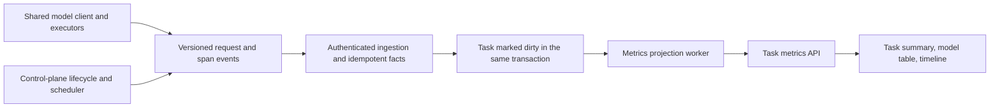

# Task execution usage and timing design

Status: initial implementation available; see [implemented behavior and rollout](task-execution-metrics.md)
for supported sources, compatibility, and remaining instrumentation. Date: 2026-09-20.

## Scope and decisions

Provide task-level answers to three questions: how many tokens each model consumed,
how long the task took, and which activities occupied that elapsed time. The requested
percentage is **within one task**, not its share of all tasks in a reporting period.

Use `TaskExecution` as the aggregation root. Include Spec analysis, every Case and
Deployment, every automatic retry and fallback, and AI acceptance review. Preserve
drill-down through Stage, Case, Run, Attempt, Segment, and individual model request.
User-triggered Case reruns that create new Tasks belong to those new Tasks; retain
links to their origins without charging both Tasks for the same call.

Task completion time and post-completion AI review time are separate. The default
token total includes both, with execution and review subtotals. Token totals may
therefore increase after task completion while its elapsed execution time stays fixed.
Expose review status and an `asOf` timestamp so this behavior is visible.

The first delivery covers per-task metrics, list summaries, and diagnostic drill-down.
Pricing, billing reconciliation, cross-task dashboards, and critical-path attribution
are outside this design's initial scope.

## Existing implementation and gaps

| Existing source                                                                                                          | Reuse and required change                                                                                                                                                                      |
| ------------------------------------------------------------------------------------------------------------------------ | ---------------------------------------------------------------------------------------------------------------------------------------------------------------------------------------------- |
| `apps/api/prisma/schema.prisma`: `TaskExecution`, `TaskExecutionStage`, `TaskStageAttempt`, `ExecutionRun`, `RunAttempt` | Existing ownership and lifecycle timestamps establish task boundaries. Current rows alone cannot reconstruct repeated waits and resumes.                                                       |
| `apps/agent-runtime/src/model-client.ts`                                                                                 | All current model calls use the Chat Completions client, with SDK retries disabled. Capture response usage and actual response model here, before validating assistant messages or tool calls. |
| `apps/agent-runtime/src/spec-analysis.executor.ts`, `browser-verification.executor.ts`                                   | Emit model start/completion/failure, tool, and segment events. Completion includes raw usage; extend identities and timing rather than count segments as model requests.                       |
| `packages/agent-runtime-protocol/src/index.ts`                                                                           | Existing model events have optional `modelCallId`, raw `usage`, model, provider, and duration. Add versioned structured usage and timing metadata with backward compatibility.                 |
| `apps/api/src/agent-runtime/spec-analysis-runtime.service.ts`, `agent-runtime-task.service.ts`                           | Analysis events live in `TaskExecutionEvent`; browser events live in `RunEvent`. Ingest both into the same metrics projection. Existing event writes enforce current leases.                   |
| `apps/api/src/execution-runs/execution-context.service.ts`                                                               | Currently projects input tokens and duration per model call. Reuse the new normalizer for consistent input/output/cache drill-down.                                                            |
| `apps/agent-runtime/src/acceptance-review.executor.ts`                                                                   | Returns only result and selected model. Add per-request telemetry, including failed fallbacks and valid responses rejected by review validation.                                               |
| `apps/api/src/task-executions/task-acceptance-review.service.ts`                                                         | Review has separate claims, attempts, revisions, and outcome ingestion. Persist usage independently from successful review outcomes.                                                           |
| `apps/web/app/console/runs/`                                                                                             | Extend the existing task list and detail. Keep full trace/context payloads out of metrics responses.                                                                                           |

Current provider labels are `OPENAI_COMPATIBLE`; this identifies a protocol, not a
vendor. Model identity must also carry a non-secret configuration identity and its
display-name snapshot. Never group different gateways solely by this provider label.

## Token accounting

Store one fact per actual request, with a stable `modelCallId` assigned before sending.
Keep logical step identity separately; fallbacks in the same step consume separately.
If SDK retries are introduced later, every HTTP attempt needs its own request identity.

| Metric                | Definition                                                                                                                          |
| --------------------- | ----------------------------------------------------------------------------------------------------------------------------------- |
| `inputTokens`         | All input tokens, including cached input.                                                                                           |
| `outputTokens`        | All output tokens reported by the provider.                                                                                         |
| `cacheReadTokens`     | Cached input tokens; a subset of input, not an additional total.                                                                    |
| `uncachedInputTokens` | `inputTokens - cacheReadTokens`, only when both are known and valid.                                                                |
| `cacheWriteTokens`    | Optional provider-specific cache creation detail; unknown unless explicitly reported and mapped.                                    |
| `reasoningTokens`     | Optional output breakdown; do not add again to output.                                                                              |
| `totalTokens`         | `inputTokens + outputTokens` when both are known. Preserve provider total separately for validation.                                |
| `cacheHitRate`        | Sum of cache reads divided by sum of input for calls where both fields are known. Show coverage; never average request percentages. |

The model table labels cache as **“其中缓存命中”**. A stacked consumption chart uses
uncached input + cache read + output; it must not stack input + cache + output.

Initial normalization adapters:

- OpenAI-style Chat Completions: `prompt_tokens`, `completion_tokens`,
  `prompt_tokens_details.cached_tokens`; optional reasoning detail from
  `completion_tokens_details.reasoning_tokens`.
- DeepSeek-compatible usage: `prompt_tokens`, `completion_tokens`,
  `prompt_cache_hit_tokens`, `prompt_cache_miss_tokens`. Check that hit + miss
  equals input when all are present. If nested cached tokens are also present,
  validate consistency and count the cache once.
- Existing historical `input_tokens` / `output_tokens` records require an explicit
  compatible mapping. Do not infer cache semantics from an arbitrary field name.
  New native provider protocols require their own adapter and fixtures.

These cache fields represent input subsets in the official
[OpenAI Chat Completions reference](https://platform.openai.com/docs/api-reference/chat/object)
and [DeepSeek caching documentation](https://api-docs.deepseek.com/guides/kv_cache/).
Keep `normalizationVersion` so retained source usage can be reprocessed.

Missing is `null`, not zero. Validate finite, nonnegative integer counts and cache
subsets; contradictory fields are flagged without silently clamping them. Preserve
the source usage object with size limits and a numeric usage-field allowlist. Do not
store prompts, response bodies, URLs, headers, or credentials in metrics tables.

Record request outcome separately from usage availability and application validation.
A valid HTTP response with invalid business output can still consume tokens. A timeout
or cancellation without usage means consumption is unknown, not free. No client-side
token estimate is presented as actual usage.

Each model aggregate includes call/success/failure/interruption counts; known sums;
per-field reported/missing counts; and `COMPLETE`, `PARTIAL`, or `UNAVAILABLE` coverage.
Partially reported usage is displayed as a known subtotal. If nothing is reported,
display “未上报”. A measured zero remains distinguishable from an unknown value.

Group by configuration snapshot and actual response model, falling back to requested
model with `modelIdentitySource=REQUESTED`. Preserve both model names. Never infer
the actual model hidden behind a gateway alias. Allow an explicit model-only rollup
for matching returned model identifiers across configurations.

## Elapsed time and activity percentages

### Task boundaries

`elapsedMs = (finishedAt ?? asOf) - createdAt` is the headline “任务总耗时”.
Use one server-selected `asOf` across the response. Cancelled and timed-out tasks use
their terminal timestamp and are labeled accordingly; completion is not a pass verdict.
Negative/missing boundaries indicate invalid/unknown data rather than a real zero.

Also expose `startedAt - createdAt` as “首次启动前等待”. It is not total queue time:
tasks can queue again after starting. Reconstruct total waits from intervals.

Maintain two independent breakdown dimensions:

- Phase: Spec analysis, Profile resolution, Case execution, and out-of-phase time.
  Waiting is contained in its phase. Skipped phases have no duration.
- Activity: model request, tool execution, platform work, active recovery, waits,
  mixed parallel activity, and unknown time.

Do not put phase and activity durations in the same additive chart. AI review has
its own post-processing timeline outside the task completion denominator.

### Activity vocabulary and measurement

| Activity                | Measurement boundary                                                                                                                                         |
| ----------------------- | ------------------------------------------------------------------------------------------------------------------------------------------------------------ |
| Model                   | Actual request invocation through full non-streaming response parsing or failure. Exclude subsequent trace upload and business-output validation.            |
| Tool                    | High-level tool start to completion. Includes its browser/network waiting; nested commands are drill-down, not extra elapsed time.                           |
| Platform                | Explicit Profile preparation, context assembly, report aggregation, evidence/video finalization, and similar instrumented work outside model/tool intervals. |
| Active recovery         | Measured reconnect/reconciliation/recovery operations. Backoff is a wait.                                                                                    |
| Human/input wait        | Durable input/intervention request through resolution, expiry, or cancellation.                                                                              |
| Resource/queue wait     | Dispatch/runtime/Profile/account-capacity waits with recorded reasons and transitions.                                                                       |
| Dependency/backoff wait | Case dependencies and retry delays, measured from scheduler state changes.                                                                                   |
| Unknown                 | No reliable activity or blocking-state evidence for the interval. Never relabel the residual as platform overhead.                                           |

Instrument nested spans with `parentSpanId`; a tool's child browser command and
its enclosing tool are one activity at the task level. Structural Task/Stage/Segment
spans are containers, not continuous platform activity. Child model/tool intervals
take precedence over their enclosing instrumented platform span.

### Parallelism: mutually exclusive wall-time buckets

Clip spans to `[createdAt, finishedAt ?? asOf)`. Sort interval boundaries and sweep
the timeline into elementary intervals using half-open ranges:

1. Within each execution lane, reduce nested spans to the active leaf category.
2. Across lanes, if active work has one category, assign the interval to that category.
   Two simultaneous model requests count as model elapsed time once.
3. If active work has different categories, assign it to “并行执行” with its category
   combination available on hover and in the timeline. Do not invent model/tool shares.
4. Only when no lane has active work, assign known waiting categories. A single
   category is a normal wait; multiple categories become “混合等待”. Pending future
   Cases do not by themselves establish a wait interval.
5. Otherwise assign unknown. If missing telemetry makes the active set uncertain,
   mark the affected interval unknown/estimated rather than assert complete coverage.

`activityPercentage = exclusiveActivityMs / elapsedMs * 100`.
All buckets, including mixed and unknown, partition the same elapsed interval and
sum to 100% for positive durations. Use rounding adjustment for display only.
For zero elapsed time, return `null` percentages.

Example: a 60-second task has 10 seconds queueing, then Case A calls a model during
seconds 10–40, Case B runs a tool during 20–50, and finalization takes 50–60:

| Exclusive bucket      | Seconds | Percentage |
| --------------------- | ------: | ---------: |
| Queue                 |      10 |      16.7% |
| Model only            |      10 |      16.7% |
| Parallel model + tool |      20 |      33.3% |
| Tool only             |      10 |      16.7% |
| Finalization          |      10 |      16.6% |

The separate diagnostic totals show 30 model-request seconds and 30 tool seconds.
These are **cumulative work durations**, can exceed task elapsed time with concurrency,
and must never be divided by task elapsed time to make an additive pie chart. A model
request latency total includes network/server waiting and is not model compute time.

### Clocks, interruption, and quality

Control-plane lifecycle/wait timestamps use database time. Runtime spans carry a
monotonic duration plus wall-clock anchor, runtime identity, and segment identity.
Estimate runtime/server clock offset and uncertainty from claim/heartbeat exchanges;
store both original and aligned timestamps. Event ingestion time is not occurrence
time. Existing executor durations may include post-response work, so historical model
latencies are labeled legacy estimates.

Do not assert sub-interval ordering when clock uncertainty is larger than the overlap
being attributed. Mark timing quality as `EXACT`, `ESTIMATED`, `PARTIAL`, or `UNAVAILABLE`;
here `EXACT` means complete instrumentation within the declared clock tolerance.
Unclosed spans are live while their lease is valid. On crash/lease loss, retain the
last reliable boundary and mark the unobserved remainder unknown. Do not extend a
request to task completion as if it were a measured call duration.

## Storage and ingestion

Use PostgreSQL alongside the existing event store; no separate analytics system is
required initially. Do not scan every trace JSON payload on every task-detail request.

| Proposed table         | Main fields and role                                                                                                                                                                                                                                                                                                                                                       |
| ---------------------- | -------------------------------------------------------------------------------------------------------------------------------------------------------------------------------------------------------------------------------------------------------------------------------------------------------------------------------------------------------------------------- |
| `TaskModelCallUsage`   | Team/task/generation; scope (`EXECUTION` or `ACCEPTANCE_REVIEW`); stage, Case/Deployment, Run/Attempt, review/revision/attempt, segment/step; modelCallId; configuration/model snapshots; request/response identity; timestamps and duration; outcome; normalized nullable token fields; source usage; coverage and normalization version. Unique `(teamId, modelCallId)`. |
| `TaskExecutionSpan`    | Team/task/generation; lane and owner identities; spanId/parentSpanId; phase/activity/wait reason; original and aligned boundaries; monotonic duration; clock uncertainty; open/closed/interrupted state; evidence references. Unique `(teamId, spanId)`.                                                                                                                   |
| `TaskExecutionMetrics` | One rebuildable snapshot per team/task/generation: known token totals and model/scope summaries, coverage, exclusive timing buckets, cumulative work durations, review status, asOf, computedAt, source revision, and algorithm version.                                                                                                                                   |

Store token counts and duration sums as database `BigInt`. Expose token counts as
decimal strings in the API; format them in the UI without lossy integer conversion.
Add indexes for task/scope/model, task/lane/start time, and dirty snapshot work.
Use existing team ownership and deletion behavior; delete metrics with their Task.

Collection flow:

Capture model telemetry centrally before response validation. Executor context supplies
ownership and logical-step identity. Add acceptance-review telemetry ingestion; do not
depend on its success-only result return. Reuse existing trace events where possible,
but prevent the client telemetry and executor completion from counting the same call twice.

Ingestion upserts facts and marks a dedicated metrics dirty revision in one transaction.
Duplicate event IDs and model-call IDs cannot increment totals twice. Updates are
monotonic (`STARTED` to terminal); late starts cannot overwrite a terminal record.
Conflicting terminal payloads are flagged, not added. Handle out-of-order delivery.
Rebuild dirty snapshots from facts, then publish with a source-revision check; if new
facts arrived during computation, leave the Task dirty for another pass.

Initial refresh target: within five seconds during execution; terminal transitions
request immediate projection. This is a design target, not a current guarantee.
Late review or usage facts refresh token summaries without changing task end time.
For live intervals, refresh at the same server `asOf`; include lag in the response.

The existing event paths reject stale leases. Simply replaying after lease expiry
would lose real consumption. Register model-call ownership before dispatch and add
a narrow telemetry-settlement path: the same authenticated worker may settle an
already registered call after expiry, under its original team/attempt/configuration.
It cannot create work, change verdicts, extend leases, or advance business state.
Bound the replay window (initial proposal: 24 hours) and validate payload identity.
Persist pending numeric telemetry to a bounded local spool for retry until acknowledgment.
Crashes before response capture or permanently lost spools remain incomplete; this
feature provides observed usage accounting, not a guarantee of provider billing parity.

Retain normalized facts, numeric source usage, and span evidence for the Task lifetime
so projections remain rebuildable when verbose trace retention expires. This differs
from retaining model input/output. Document retention and explicit deletion together.

## API and Console

Proposed read endpoints, subject to the existing team and `run:read`/Console auth:

- `GET /v2/tasks/:id/metrics`: summary, model aggregates, coverage, elapsed time,
  exclusive activity breakdown, phase breakdown, and post-processing subtotal.
- `GET /v2/tasks/:id/metrics/model-calls`: cursor-paginated requests, filterable by
  scope/model/Case/Deployment/Run/Attempt and outcome.
- `GET /v2/tasks/:id/metrics/timeline`: bounded time window and paginated lanes/spans.
- Equivalent authenticated `/console/api/tasks/:id/metrics...` routes.

The summary accepts `scope=ALL|EXECUTION|ACCEPTANCE_REVIEW`, default `ALL`, for token
aggregation. Execution time always describes the Task boundary; review time is a
separately named field. Responses carry `asOf`, `computedAt`, coverage, timing quality,
algorithm version, and `refreshPending`. No raw context or secret configuration data.
Batch summaries with existing Task-list queries to avoid one API call per row.

Task list adds total elapsed time and known token total, with partial-data markers.
Task detail adds a “消耗与耗时” view containing:

1. Summary cards: task elapsed time, active wall time, all-work-blocked wait time,
   known input/output/cache and total tokens. Unknown time remains explicit.
2. Per-model table: configuration/model, request count, Input, Output,
   “其中缓存命中”, cache hit rate and coverage, and cumulative request duration.
3. A 100% stacked elapsed-time bar with exact duration labels and mixed/unknown legend.
4. Phase timeline and Case/Deployment lanes, expandable to Run/Attempt/model/tool
   details. Link to the existing execution-context page when available.
5. AI acceptance-review status, tokens, and time shown separately below execution.

All illustrative UI data must be labeled examples. Currency is not shown until a
separate, versioned pricing design is agreed.

## Delivery and validation

Deliver this feature in three implementation increments:

1. **Usage foundation:** shared normalizer/client capture, protocol additions,
   idempotent facts, review telemetry, projection and metrics read API. Basic task
   elapsed time and per-model consumption become available.
2. **Time attribution:** control-plane wait transitions, platform/tool/recovery
   spans, clock alignment, interval sweep, quality reporting, and Case timelines.
   Do not launch an exact-looking percentage chart before these sources exist.
3. **Console and historical data:** list summaries and full metrics view, bounded
   backfill from existing events, retention/rebuild tooling, and rollout checks.

Backfill analysis from `TaskExecutionEvent` and browser execution from `RunEvent`.
Use modelCallId when present; use stable source-event identity for terminal legacy
records and correlate starts only when unambiguous. Historical review usage cannot
be recovered from its saved model/result. Unknown cache usage, missing waits, gateway
identity, and unmatched events stay explicitly unknown. Backfill is resumable and
idempotent. Never infer old consumption from current configuration or prompt length.

Deploy additive schema and tolerant API readers before new Runtime writers. Negotiate
telemetry capability; an older worker produces partial metrics instead of failing its
task. Disabling the projection/UI must preserve business execution and captured facts.

Required implementation acceptance cases:

- Input 1,000, cache 600, output 100 yields total 1,100 and uncached input 400.
- Missing usage, a known zero, partial fields, malformed counts, and conflicting
  provider totals have distinct results; weighted cache hit rate uses covered input.
- Valid usage survives output-validation failure, fallback, review retries, and
  cancellation after response capture. Timeout with no usage stays unknown.
- Duplicate/reordered starts and terminal events, dirty-worker races, and eligible
  stale-lease settlements do not duplicate or lose known totals. Cross-team or
  unregistered settlements fail without changing business state.
- Parallel model/model and model/tool calls, nested browser tools, wait in one Case
  while another runs, all-Cases waiting, and mixed waits match the sweep definition.
- Multiple HITL pauses, retry backoff, resumed segments, clock skew, unclosed spans,
  zero-duration tasks, cancellation, and finalization preserve elapsed-time invariants.
- All exclusive buckets sum to elapsed time; work-duration sums may exceed it.
  Review completion changes tokens but never extends the finished Task's elapsed time.
- New-task reruns are accounted independently; historical attempts remain included
  within their original Task. Source pruning does not prevent projection rebuild.
- UI clearly distinguishes complete, partial, unavailable, and still-running metrics;
  task-list access uses batched summaries and details use bounded pagination.

This document describes the target design. The implementation guide distinguishes
delivered behavior from remaining instrumentation and API refinements. Deployment is
separate from local development and disposable-database validation.
