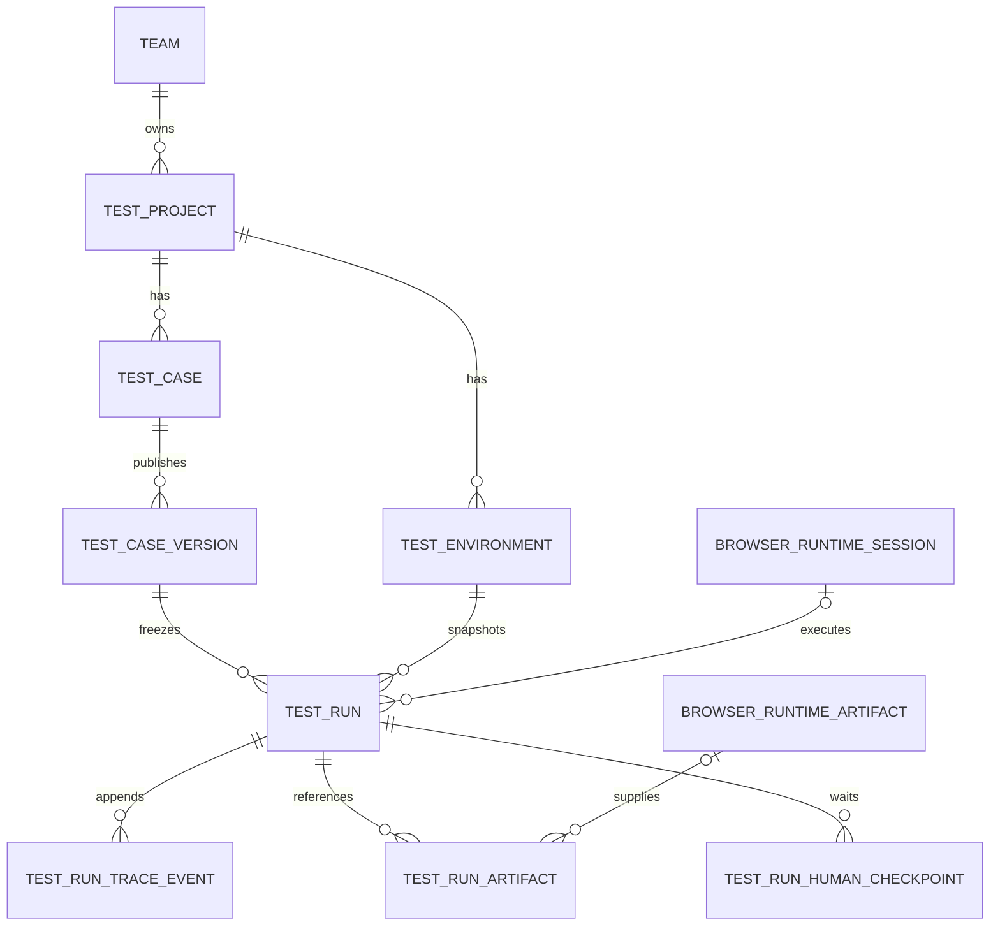

# Test data model

DevProof stores reusable test definitions separately from immutable execution inputs and append-only evidence.

## Relationships

`TestProject` groups one product or workflow area. `TestEnvironment` contains public variables, encrypted secrets, and secret key names. `TestCase` contains mutable metadata; executable content is published as an immutable `TestCaseVersion`.

`TestRun` pins one Case Version and one Environment and copies a `definitionSnapshot` and a secret-free `environmentSnapshot`. Workers consume these frozen snapshots rather than rereading mutable Case or Environment records.

## Case DSL v1

The fixed `schemaVersion: 1` DSL supports:

- `browser.navigate`
- `browser.click`
- `browser.type`
- `browser.press`
- `assert.url`
- `assert.text`
- `capture`
- `human.checkpoint`

Every step has an ID that is unique within the version. Secrets are referenced as `{ kind: "ENV_SECRET", key: "..." }`; plaintext secret fields are not accepted. Persistent Profiles use an opaque Profile key.

Case Versions are hashed from canonical JSON with SHA-256. Version numbers increment inside a serializable transaction, and publishing a definition identical to the latest version is rejected.

## Database invariants

- Every record is scoped by `team_id`; composite foreign keys prevent cross-Team relationships.
- Case Versions cannot be updated or deleted after publication.
- A Test Run cannot change its Team, Project, Case, Version, Environment, trigger, idempotency key, or snapshots after creation.
- Trace Events are insert-only and use a database-generated monotonic sequence.
- Artifact rows reference a Runtime Artifact or object-storage key; binary content is never stored in PostgreSQL.
- `team_id + idempotency_key` is unique, so a repeated create request returns the same Run.
- Business objects use archive state rather than hard-delete APIs; retention workers handle evidence cleanup.

## Secrets and traces

Environment secrets use AES-256-GCM envelope encryption under the configured master key. Data APIs and Run snapshots expose secret key names, not ciphertext envelopes or values.

Trace input is recursively redacted for credential-shaped keys. Browser and HTTP capture still must perform source-specific redaction because field-name filtering cannot identify every secret embedded in DOM or response content.

## Console API

- `GET/POST /console/api/test-projects`
- `PUT /console/api/test-projects/:projectId`
- `GET/POST /console/api/test-projects/:projectId/environments`
- `PUT /console/api/test-environments/:environmentId`
- `GET/POST /console/api/test-projects/:projectId/cases`
- `GET/PUT /console/api/test-cases/:caseId`
- `POST /console/api/test-cases/:caseId/versions`
- `GET/POST /console/api/test-runs`
- `GET /console/api/test-runs/:runId`
- `POST /console/api/test-runs/:runId/checkpoints/:checkpointId/resolve`

Routes use the Feishu session and derive Team scope from server-side authentication. Clients cannot submit or override `team_id`. Trace, Artifact, and Checkpoint creation remain trusted server-side operations.
